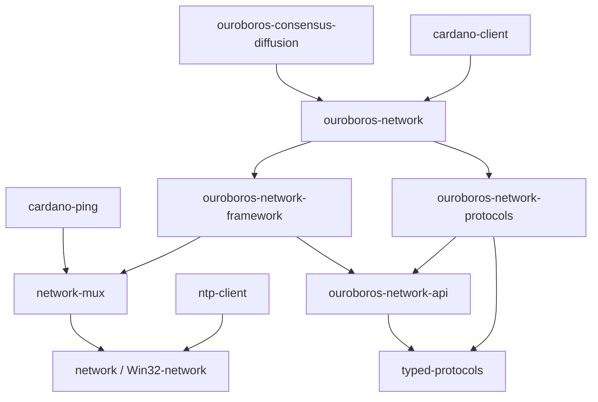

# Ouroboros Network

[](https://ci.iog.io/job/IntersectMBO-ouroboros-network/master/x86_64-linux.required)
[](https://ci.iog.io/job/IntersectMBO-ouroboros-network/master/x86_64-darwin.required)
[](https://ci.iog.io/job/IntersectMBO-ouroboros-network/master/aarch64-darwin.required)
[](https://github.com/intersectmbo/ouroboros-network/actions/workflows/build.yml)
[](https://github.com/intersectmbo/ouroboros-network/actions/workflows/nightly.yml)
[](https://ouroboros-network.cardano.intersectmbo.org/)
[](https://discord.gg/8ncb7fgG)

This repository contains specification and implementation of the network
protocols and applications for Ouroboros family of protocols, primiarly used by
[cardano-node], [cardano-cli], [cardano-db-sync] or [cardano-wallet].

The following graph shows the dependency tree.  The top-level package is
`ouroboros-consensus-diffusion` which is part of [ouroboros-consensus]



* `network-mux` - implementation of a general network multiplexer.
* `ouroboros-network-api` - shared API between `network` and `consensus` components.
* `ouroboros-network-framework` - low-level network components, e.g. snockets,
  connection manager, inbound governor, handshake mini-protocol, network
  simulator. 
* `ouroboros-network-protocols` - implementation of all /node-to-node/
  & /node-to-client/ protocols.  Also contains a testing library which is
  implementing various applications for testing purposes.
* `ouroboros-network`- top-level integration of all network components also
  defines `node-to-node` and `node-to-client` API.  It contains the implementation
  of the outbound governor.
* `ouroboros-network-mock` & `ouroboros-network-testing` - shared testing code.
* `ntp-client` - an `ntp` client (used by `cardano-wallet`).
* `cardano-ping` - a library which implements the core functionality of
  `cardano-cli ping` command.
* `cardano-client` - a subscription for `node-to-client` which wants to connect
  to a `cardano-node`.

Libraries:

* `monoidal-synchronisation` - a small standalone package which contains
  synchronisation primitives.


## Documentation

We have two documents which describe various levels of the networking layer of
the Cardano Shelley implementation:

* [Introduction to the design of Data Diffusion and Networking of Cardano Shelley](https://ouroboros-network.cardano.intersectmbo.org/pdfs/network-design)

  This document explains the technical requirements and key constraints for the networking
  layer of the _Cardano Shelley_ implementation of _Ouroboros Praos_.  This is
  a design document.

* [The Shelley Networking Protocol](https://ouroboros-network.cardano.intersectmbo.org/pdfs/network-spec)

  This document is a technical specification of the networking protocol.  It
  includes serialisation formats, necessary details of the multiplexer and
  technical specifications of mini-protocols used by either _node-to-node_ and
  _node-to-client_ flavours of the protocol.

* [Haddock documentation][ouroboros-network]

- [Official Cardano Documentation](https://docs.cardano.org/en/latest/)

  Specifically the section "Explore Cardano" is helpful, since it talks about the [Cardano Architecture](https://docs.cardano.org/explore-cardano/cardano-architecture), [Cardano Design Rationale](https://docs.cardano.org/explore-cardano/cardano-design-rationale), the [Cardano Network](https://docs.cardano.org/explore-cardano/cardano-network/about-the-cardano-network), etc.
  Although the Cardano documentation is less detailed, it is a good place to start and refresh some more basic concepts about Cardano.

### Work progress

On a biweekly basis, we publish updates on [cardano-updates].
We are also tracking our current work in the [Ouroboros Network Project][ouroboros-network-project].

### Contributing

The contributing guide is available [here][contributing-guide].
The style guide is available [here][style-guide].
The code of conduct is available [here][code-of-conduct].

## Ouroboros Network API

The API consists of three layers:

• mini-protocol APIs, which are GADTs for each mini-protocol under `Ouroboros.Network.Protocol` (defined in `ouroboros-network-protocols` package); this hides heavy type machinery of session types.  One only needs the [`Peer`] or [`PeerPipelined`] type  when one is using [`runPeer`] or [`runPeerPipelined`] function and each protocol exposes a function to create it (e.g. [`chainSyncClientPeer`].  There is also API which allows to run a [`Peer`] or [`PipelinedPeer`] with limits (i.e. per state timeouts & per message size limits).

• callback [`MiniProtocolCb`].  The callback is wrapped in `OuroborosApplication` GADT which allows to differentiate the initiator/responder (or client/server) callbacks.

• versioning which is a map from version numbers to the above callbacks and version data (the tricky part here is that version data type can be different between different versions; there is a simple way of building this map using a semigroup). You can use [`simpleSingletonVersion`] if your application does not depend on negotiated version data.  However, [`Ouroboros.Network.NodeToNode`] and [`Ouroboros.Network.NodeToClient`] expose API which hides versioning from the caller.


## Demo applications

* [demo-chain-sync](https://github.com/intersectmbo/ouroboros-network/wiki/Ouroboros-Network-Demo)
* [cardano-ping](https://github.com/intersectmbo/ouroboros-network/wiki/cardano-ping)
* [mux-demo](https://github.com/intersectmbo/ouroboros-network/blob/master/network-mux/demo/mux-demo.hs)
* [demo-ping-pong](https://github.com/intersectmbo/ouroboros-network/blob/master/ouroboros-network-framework/demo/ping-pong.hs)
* [demo-ntp-client](https://github.com/intersectmbo/ouroboros-network/blob/master/ntp-client/demo/Main.hs)

<details>
<summary>Instructions</summary>
To run a demo type:

```
cabal run <DEMO_NAME> --
```

After `--` you will need to pass arguments, when a demo is run without
arguments it will specify what arguments it needs.
</details>

[cardano-cli]:  https://github.com/intersectmbo/cardano-cli
[cardano-db-sync]:  https://github.com/intersectmbo/cardano-db-sync
[cardano-node]:  https://github.com/intersectmbo/cardano-node
[cardano-wallet]:  https://github.com/cardano-foundation/cardano-wallet
[ouroboros-consensus]: https://github.com/intersectmbo/ouroboros-consensus
[ouroboros-network]: https://ouroboros-network.cardano.intersectmbo.org
[cardano-updates]: https://updates.cardano.intersectmbo.org/tags/network
[ouroboros-network-project]: https://github.com/orgs/IntersectMBO/projects/5/views/1
[contributing-guide]: ./CONTRIBUTING.md
[code-of-conduct]: ./CODE_OF_CONDUCT.md
[style-guide]: ./docs/StyleGuide.md
[`MiniProtocolCb`]: https://ouroboros-network.cardano.intersectmbo.org/ouroboros-network-framework/Ouroboros-Network-Mux.html#t:MiniProtocolCb
[`Peer`]: https://input-output-hk.github.io/typed-protocols/typed-protocols/Network-TypedProtocol-Core.html#t:Peer
[`PeerPipelines`]: https://input-output-hk.github.io/typed-protocols/typed-protocols/Network-TypedProtocol-Pipelined.html#t:PeerPipelined
[`runPeer`]: https://ouroboros-network.cardano.intersectmbo.org/ouroboros-network-framework/Ouroboros-Network-Driver.html#v:runPeer
[`runPipelinedPeer`]: https://ouroboros-network.cardano.intersectmbo.org/ouroboros-network-framework/Ouroboros-Network-Driver.html#v:runPipelinedPeer
[`chainSyncClientPeer`]: https://ouroboros-network.cardano.intersectmbo.org/ouroboros-network-protocols/Ouroboros-Network-Protocol-ChainSync-Client.html#v:chainSyncClientPeer
[`OuroborosApplication`]: https://ouroboros-network.cardano.intersectmbo.org/ouroboros-network-framework/Ouroboros-Network-Mux.html#t:OuroborosApplication
[`simpleSingletonVersion`]: https://ouroboros-network.cardano.intersectmbo.org/ouroboros-network-framework/Ouroboros-Network-Protocol-Handshake-Version.html#v:simpleSingletonVersions
[`Ouroboros.Network.NodeToNode`]: https://ouroboros-network.cardano.intersectmbo.org/ouroboros-network/Ouroboros-Network-NodeToNode.html
[`Ouroboros.Network.NodeToClient`]: https://ouroboros-network.cardano.intersectmbo.org/ouroboros-network/Ouroboros-Network-NodeToClient.html
