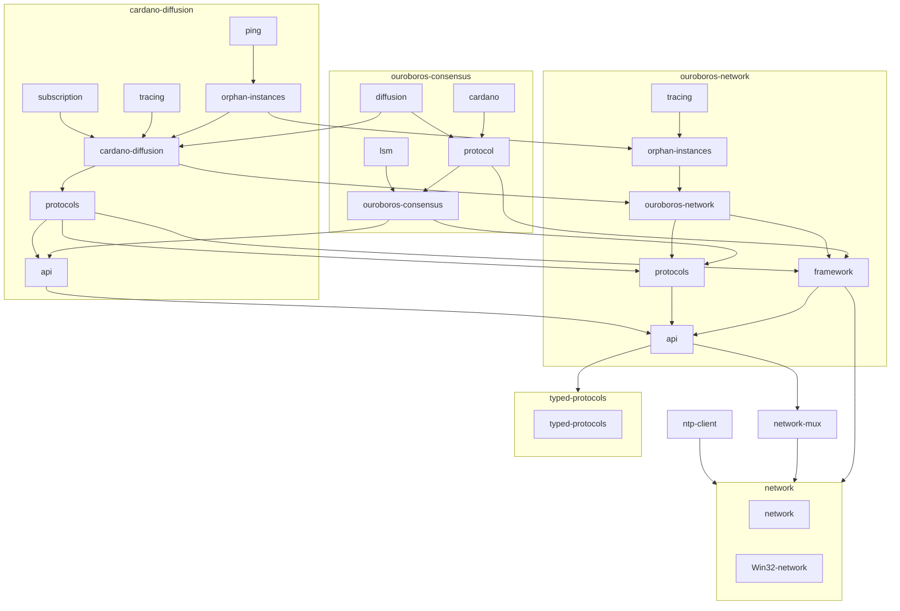

# Ouroboros Network

[](https://ci.iog.io/job/IntersectMBO-ouroboros-network/main/x86_64-linux.required)
[](https://ci.iog.io/job/IntersectMBO-ouroboros-network/main/x86_64-darwin.required)
[](https://ci.iog.io/job/IntersectMBO-ouroboros-network/main/aarch64-darwin.required)
[](https://github.com/intersectmbo/ouroboros-network/actions/workflows/build.yml)
[](https://github.com/intersectmbo/ouroboros-network/actions/workflows/nightly.yml)
[](https://ouroboros-network.cardano.intersectmbo.org/)
[](https://discord.com/channels/1136727663583698984/1239889324745429122)

This repository contains specification and implementation of the network
protocols and applications for Ouroboros family of protocols, primarily used by
[cardano-node], [cardano-cli], [cardano-db-sync] or [cardano-wallet].

The following graph shows the dependency tree between the libraries in this
repository and in [ouroboros-consensus].  The top-level component is
`ouroboros-consensus:diffusion`, a public sublibrary of the
[ouroboros-consensus] package.  `ouroboros-network`, `cardano-diffusion` and
`ouroboros-consensus` are each a single Cabal package exposing several public
sublibraries; node labels follow `build-depends` syntax: a bare name (e.g.
`ouroboros-network`) refers to a package's main library, `pkg:sublib` refers
to one of its public sublibraries.


```mermaid
flowchart TB
  subgraph ouroboros-consensus
    ocCardano[cardano]
    ocProtocol[protocol]
    ocMain[ouroboros-consensus]
    ocDiffusion[diffusion]
    ocLsm[lsm]

    click ocCardano "https://github.com/intersectmbo/ouroboros-consensus/" _blank
    click ocProtocol "https://github.com/intersectmbo/ouroboros-consensus/" _blank
    click ocMain "https://github.com/intersectmbo/ouroboros-consensus/" _blank
    click ocDiffusion "https://github.com/intersectmbo/ouroboros-consensus/" _blank
    click ocLsm "https://github.com/intersectmbo/ouroboros-consensus/" _blank
  end

  subgraph ouroboros-network
    onApi[api]
    onMain[ouroboros-network]
    onFramework[framework]
    onProtocols[protocols]
    onTracing[tracing]
    onOrphan[orphan-instances]

    click onApi "https://ouroboros-network.cardano.intersectmbo.org/ouroboros-network/api/" _blank
    click onMain "https://ouroboros-network.cardano.intersectmbo.org/ouroboros-network/" _blank
    click onFramework "https://ouroboros-network.cardano.intersectmbo.org/ouroboros-network/framework/" _blank
    click onProtocols "https://ouroboros-network.cardano.intersectmbo.org/ouroboros-network/protocols/" _blank
    click onTracing "https://ouroboros-network.cardano.intersectmbo.org/ouroboros-network/tracing/" _blank
    click onOrphan "https://ouroboros-network.cardano.intersectmbo.org/ouroboros-network/orphan-instances/" _blank
  end

  subgraph cardano-diffusion
    cdApi[api]
    cdMain[cardano-diffusion]
    cdProtocols[protocols]
    cdOrphan[orphan-instances]
    cdTracing[tracing]
    cdSubscription[subscription]
    cdPing[ping]

    click cdApi "https://ouroboros-network.cardano.intersectmbo.org/cardano-diffusion/api/" _blank
    click cdMain "https://ouroboros-network.cardano.intersectmbo.org/cardano-diffusion/" _blank
    click cdProtocols "https://ouroboros-network.cardano.intersectmbo.org/cardano-diffusion/protocols/" _blank
    click cdOrphan "https://ouroboros-network.cardano.intersectmbo.org/cardano-diffusion/orphan-instances/" _blank
    click cdTracing "https://ouroboros-network.cardano.intersectmbo.org/cardano-diffusion/tracing/" _blank
    click cdSubscription "https://ouroboros-network.cardano.intersectmbo.org/cardano-diffusion/subscription/" _blank
    click cdPing "https://ouroboros-network.cardano.intersectmbo.org/cardano-diffusion/ping/" _blank
  end

  networkMux[network-mux]
  ntpClient[ntp-client]

  click networkMux "https://ouroboros-network.cardano.intersectmbo.org/network-mux/" _blank
  click ntpClient "https://ouroboros-network.cardano.intersectmbo.org/ntp-client/" _blank

  subgraph network
    net[network]
    win32[Win32-network]

    click net "https://hackage.haskell.org/package/network" _blank
    click win32 "https://hackage.haskell.org/package/Win32-network" _blank
  end

  subgraph typed-protocols
    tp[typed-protocols]

    click tp "https://github.com/input-output-hk/typed-protocols/" _blank
  end

  %% ouroboros-consensus
  ocCardano --> ocProtocol
  ocProtocol --> ocMain
  ocProtocol --> onFramework
  ocMain --> cdApi
  ocMain --> onProtocols
  ocLsm --> ocMain
  ocDiffusion --> cdMain
  ocDiffusion --> ocProtocol

  %% ouroboros-network
  onFramework --> onApi
  onProtocols --> onApi
  onMain --> onFramework
  onMain --> onProtocols
  onOrphan --> onMain
  onTracing --> onOrphan
  onApi --> networkMux

  %% cardano-diffusion
  cdApi --> onApi
  cdProtocols --> cdApi
  cdProtocols --> onFramework
  cdProtocols --> onProtocols
  cdMain --> cdProtocols
  cdMain --> onMain
  cdOrphan --> cdMain
  cdOrphan --> onOrphan
  cdTracing --> cdMain
  cdSubscription --> cdMain
  cdPing --> cdOrphan

  %% external packages
  onApi --> typed-protocols
  onFramework --> network
  networkMux --> network
  ntpClient --> network
```

* `network-mux` - implementation of a general network multiplexer.
* `ouroboros-network` - networking library which supports the /Ouroboros/
  family of protocols.  It is a single Cabal package with several public
  sublibraries:
  * `ouroboros-network:api` - shared API between `ouroboros-network` and
    `ouroboros-consensus`.
  * `ouroboros-network:framework` - low-level network components, e.g.
    snockets, connection manager, inbound governor, handshake mini-protocol,
    network simulator.
  * `ouroboros-network:protocols` - implementation of all /node-to-node/ &
    /node-to-client/ protocols.
  * `ouroboros-network` (main library) - top-level integration of all network
    components; defines the outbound governor, block-fetch and
    tx-submission logic.
  * `ouroboros-network:tracing` & `ouroboros-network:orphan-instances` -
    tracing and orphan instances, split out to keep the libraries above
    dependency-light.
* `cardano-diffusion` - networking layer specific to the Cardano blockchain
  protocol.  Like `ouroboros-network`, it is a single Cabal package with
  several public sublibraries:
  * `cardano-diffusion:api` - shared Cardano-specific API.
  * `cardano-diffusion` (main library) - the Cardano `Diffusion`,
    `NodeToNode` & `NodeToClient` API, combining `ouroboros-network` with
    Cardano-specific configuration and peer selection.
  * `cardano-diffusion:protocols` - Cardano-specific protocol codecs;
    re-exports the rest of `ouroboros-network:protocols` under the
    `Cardano.Network` namespace.
  * `cardano-diffusion:subscription` - a subscription mechanism for
    `node-to-client` connections to a `cardano-node` (formerly the
    standalone `cardano-client` package).
  * `cardano-diffusion:ping` - implements the core functionality of the
    `cardano-cli ping` command (formerly the standalone `cardano-ping`
    package).
  * `cardano-diffusion:tracing` & `cardano-diffusion:orphan-instances` - as
    above, split out for a lighter dependency footprint.
* `ntp-client` - an `ntp` client (used by `cardano-wallet`).

Each package above also has several `*-tests-lib` public sublibraries and
test-suites providing shared testing code (e.g. mock chains, simulated
network snockets); these are omitted from the graph above for clarity.

The [ouroboros-consensus] repository underwent a similar consolidation: what
used to be four separate packages (`ouroboros-consensus`,
`ouroboros-consensus-protocol`, `ouroboros-consensus-diffusion`,
`ouroboros-consensus-cardano`) are now public sublibraries of a single
`ouroboros-consensus` package:

* `ouroboros-consensus` (main library) - the consensus layer core: ledger,
  mempool, ChainDB, HardFork combinator, etc.
* `ouroboros-consensus:protocol` - the Praos & TPraos protocol
  implementations.
* `ouroboros-consensus:diffusion` - wires the consensus layer to the network
  layer; this is the historical `ouroboros-consensus-diffusion` package and
  the top-level component of the whole dependency tree above.
* `ouroboros-consensus:cardano` - the Cardano ledger eras (Byron, Shelley,
  Allegra, ...) instantiated on top of the consensus core; this is the
  historical `ouroboros-consensus-cardano` package.
* `ouroboros-consensus:lsm` - an LSM-tree backed `LedgerDB` V2 storage
  backend.

Libraries:

* `monoidal-synchronisation` - a small standalone package which contains
  synchronisation primitives.
* `acts-generic` - generic instances for the `Act` type class.
* `quickcheck-monoids` - QuickCheck utilities for monoids.


## Documentation

We have two documents which describe various levels of the networking layer of
the Cardano Shelley implementation:

* [Introduction to the Design of Data Diffusion and Networking of Cardano Shelley](https://ouroboros-network.cardano.intersectmbo.org/pdfs/network-design)

  This document explains the technical requirements and key constraints for the networking
  layer of the _Cardano Shelley_ implementation of _Ouroboros Praos_.  This is
  a design document.

* [The Shelley Networking Protocol](https://ouroboros-network.cardano.intersectmbo.org/pdfs/network-spec)

  This document is a technical specification of the networking protocol.  It
  includes serialisation formats, necessary details of the multiplexer and
  technical specifications of mini-protocols used by either _node-to-node_ and
  _node-to-client_ flavours of the protocol.

* [Haddock documentation][ouroboros-network]

- [Official Cardano Documentation](https://docs.cardano.org/en/latest/)

  Specifically the section "Explore Cardano" is helpful, since it talks about the [Cardano Architecture](https://docs.cardano.org/explore-cardano/cardano-architecture), [Cardano Design Rationale](https://docs.cardano.org/explore-cardano/cardano-design-rationale), the [Cardano Network](https://docs.cardano.org/explore-cardano/cardano-network/about-the-cardano-network), etc.
  Although the Cardano documentation is less detailed, it is a good place to start and refresh some more basic concepts about Cardano.

### Work progress

On a biweekly basis, we publish updates on [cardano-updates].
We are also tracking our current work in the [Ouroboros Network Project][ouroboros-network-project].

### Contributing

The contributing guide is available [here][contributing-guide].
The style guide is available [here][style-guide].
The code of conduct is available [here][code-of-conduct].

## Ouroboros Network API

The API consists of three layers:

• mini-protocol APIs, which are GADTs for each mini-protocol under `Ouroboros.Network.Protocol` (defined in `ouroboros-network-protocols` package); this hides heavy type machinery of session types.  One only needs the [`Peer`] or [`PeerPipelined`] type when one is using [`runPeer`] or [`runPeerPipelined`] function and each protocol exposes a function to create it (e.g. [`chainSyncClientPeer`].  There is also API which allows to run a [`Peer`] or [`PipelinedPeer`] with limits (i.e. per state timeouts & per message size limits).

• callback [`MiniProtocolCb`].  The callback is wrapped in `OuroborosApplication` GADT which allows to differentiate the initiator/responder (or client/server) callbacks.

• versioning which is a map from version numbers to the above callbacks and version data (the tricky part here is that version data type can be different between different versions; there is a simple way of building this map using a semigroup). You can use [`simpleSingletonVersion`] if your application does not depend on negotiated version data.  However, [`Cardano.Network.NodeToNode`] and [`Cardano.Network.NodeToClient`] expose API which hides versioning from the caller.


## Demo applications

* [demo-chain-sync](https://github.com/intersectmbo/ouroboros-network/wiki/Ouroboros-Network-Demo)
* [cardano-ping](https://github.com/intersectmbo/ouroboros-network/wiki/cardano-ping)
* [mux-demo](https://github.com/intersectmbo/ouroboros-network/blob/main/network-mux/demo/mux-demo.hs)
* [demo-ping-pong](https://github.com/intersectmbo/ouroboros-network/blob/main/ouroboros-network-framework/demo/ping-pong.hs)
* [demo-ntp-client](https://github.com/intersectmbo/ouroboros-network/blob/main/ntp-client/demo/Main.hs)

<details>
<summary>Instructions</summary>
To run a demo type:

```
cabal run <DEMO_NAME> --
```

After `--` you will need to pass arguments, when a demo is run without
arguments it will specify what arguments it needs.
</details>

[cardano-cli]:  https://github.com/intersectmbo/cardano-cli
[cardano-db-sync]:  https://github.com/intersectmbo/cardano-db-sync
[cardano-node]:  https://github.com/intersectmbo/cardano-node
[cardano-wallet]:  https://github.com/cardano-foundation/cardano-wallet
[ouroboros-consensus]: https://github.com/intersectmbo/ouroboros-consensus
[ouroboros-network]: https://ouroboros-network.cardano.intersectmbo.org
[cardano-updates]: https://updates.cardano.intersectmbo.org/tags/network
[ouroboros-network-project]: https://github.com/orgs/IntersectMBO/projects/5/views/1
[contributing-guide]: ./CONTRIBUTING.md
[code-of-conduct]: ./CODE_OF_CONDUCT.md
[style-guide]: ./docs/StyleGuide.md
[`MiniProtocolCb`]: https://ouroboros-network.cardano.intersectmbo.org/ouroboros-network-framework/Ouroboros-Network-Mux.html#t:MiniProtocolCb
[`Peer`]: https://input-output-hk.github.io/typed-protocols/typed-protocols/Network-TypedProtocol-Core.html#t:Peer
[`PeerPipelined`]: https://input-output-hk.github.io/typed-protocols/typed-protocols/Network-TypedProtocol-Pipelined.html#t:PeerPipelined
[`runPeer`]: https://ouroboros-network.cardano.intersectmbo.org/ouroboros-network-framework/Ouroboros-Network-Driver.html#v:runPeer
[`runPipelinedPeer`]: https://ouroboros-network.cardano.intersectmbo.org/ouroboros-network-framework/Ouroboros-Network-Driver.html#v:runPipelinedPeer
[`chainSyncClientPeer`]: https://ouroboros-network.cardano.intersectmbo.org/ouroboros-network-protocols/Ouroboros-Network-Protocol-ChainSync-Client.html#v:chainSyncClientPeer
[`OuroborosApplication`]: https://ouroboros-network.cardano.intersectmbo.org/ouroboros-network-framework/Ouroboros-Network-Mux.html#t:OuroborosApplication
[`simpleSingletonVersion`]: https://ouroboros-network.cardano.intersectmbo.org/ouroboros-network-framework/Ouroboros-Network-Protocol-Handshake-Version.html#v:simpleSingletonVersions
[`Cardano.Network.NodeToNode`]: https://ouroboros-network.cardano.intersectmbo.org/cardano-diffusion/Cardano-Network-NodeToNode.html
[`Cardano.Network.NodeToClient`]: https://ouroboros-network.cardano.intersectmbo.org/cardano-diffusion/Cardano-Network-NodeToClient.html
