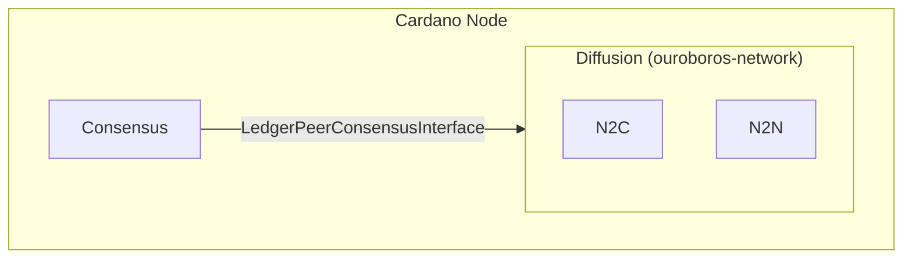
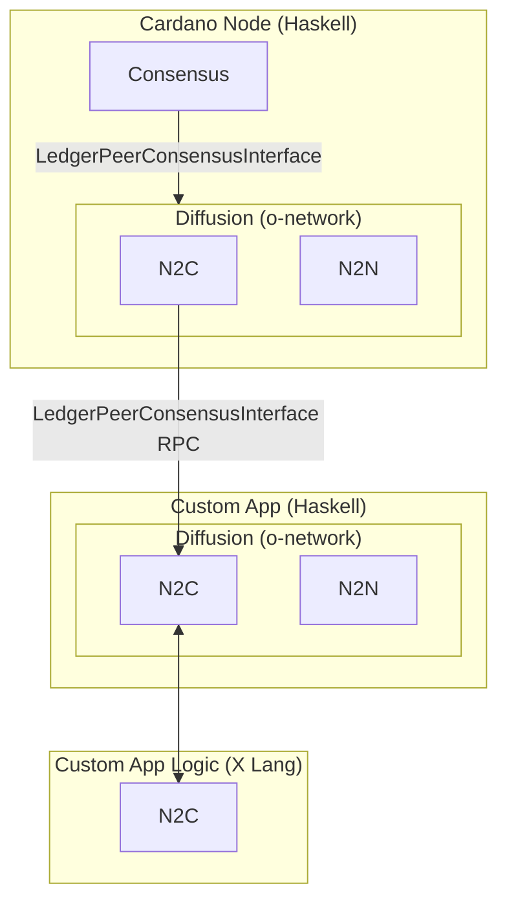
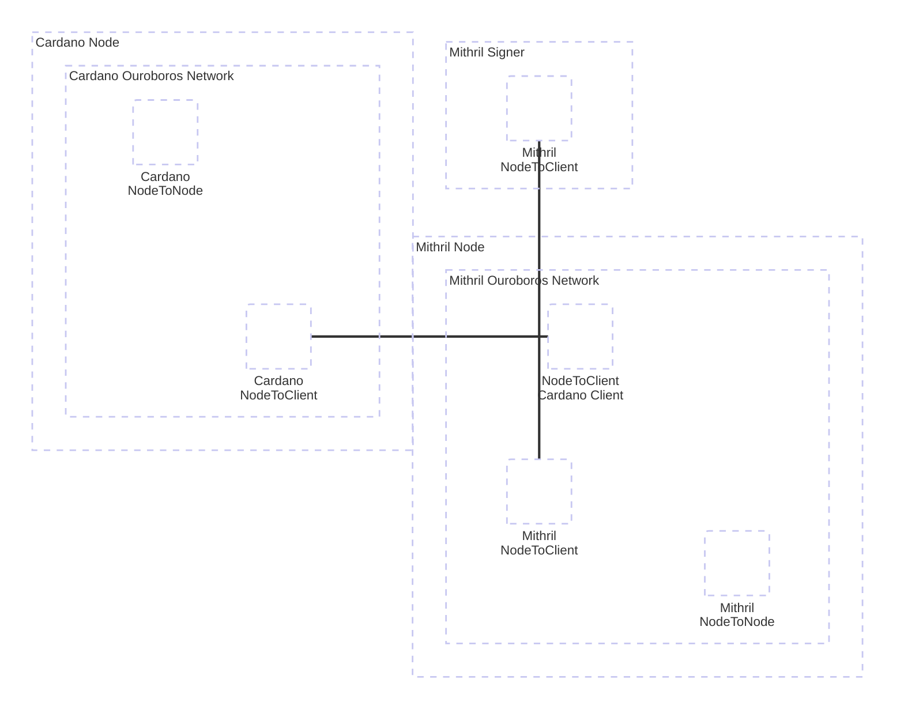
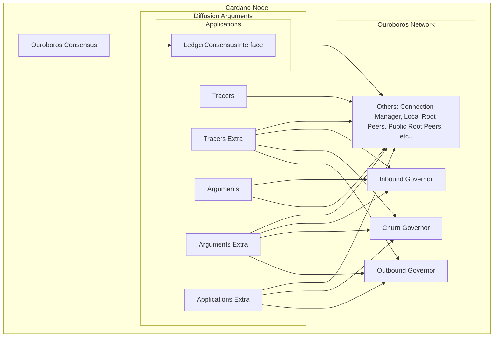

<!-- TOC start (generated with https://github.com/derlin/bitdowntoc) -->

## Table of Contents

- [Reusable Diffusion](#reusable-diffusion)
   * [Current State](#current-state)
      * [Current Design Overview](#current-design)
      * [Target Design](#target-design)
   * [Current Stake Holders](#current-stakeholders)
      * [Mithril Node](#mithril-node)
        * [Mithril Processes](#mithril-processes)
      * [Others](#others)
   * [Configurable Parameters](#configurable-parameters)
   * [Proposed Configuration Structure](#proposed-configuration-structure)
   * [Main P2P Components](#main-p2p-components)
      + [Outbound Governor (Peer Selection Governor)](#outbound-governor-peer-selection-governor)
         - [Monitoring Actions](#monitoring-actions)
      + [Churn Governor](#churn-governor)
      + [Inbound Governor, Connection Manager, etc.](#inbound-governor-connection-manager-etc)
   * [Preliminary Plan](#preliminary-plan)

<!-- TOC end -->

<!-- TOC --><a name="reusable-diffusion"></a>
## Reusable Diffusion

This document outlines the findings of an investigation into the Cardano diffusion layer and explores how to make it reusable for third-party users. The goal is to transform the _current_ diffusion layer so as to become a library that enables others to build overlay networks, leveraging the existing self-balancing, self-optimizing, and self-healing capabilities of the current Cardano Node network. Users will be able to diffuse any data across their network by running custom protocols, defining their own targets for connectivity, and setting their own governance policies (such as churning and monitoring jobs).

_Note_ that this project is not to meant to be a fork of the current `ouroboros-network` repository, but rather a major refactorisation.

<!-- TOC --><a name="current-state"></a>
### Current State

In the current architecture, the Cardano node initializes the consensus layer, which in turn initializes the diffusion layer. The node parses configuration files and passes diffusion parameters to the consensus layer via `RunNodeArgs` and `StdRunNodeArgs`. Consensus then uses these parameters to initialise the diffusion layer.

Additionally, the consensus layer is responsible for providing the diffusion layer with the versioned applications (mini-protocols) bundle, which manages peer connections and promotions. This is important for protocols like the handshake protocol and codecs. The consensus layer also supplies the `LedgerPeersConsensusInterface`, which informs the diffusion layer about the latest slot numbers, ledger state judgments, and the ledger peers.

Currently the consensus layer only depends on the `ouroboros-network` and `ouroboros-network-api` libraries. `ouroboros-network` offers the top-level integration of all network components (i.e. diffusion layer). `ouroboros-network-api` the shared API between network and consensus layers.

The goal of a reusable design is to allow third-party users to leverage the `ouroboros-network` diffusion layer for their own applications by decoupling it from Cardano node-specific implementation details. Currently, the only client for the `ouroboros-network` is the Cardano node, which, being part of a monolithic stack, has tightly coupled many implementation specifics to the diffusion layer. This coupling makes it difficult to reuse the diffusion layer
for other purposes.

<!-- TOC --><a name="current-design"></a>
#### Current Design Overview:



<!-- TOC --><a name="target-design"></a>
#### Target Design:



The main objective is to abstract and extend the `LedgerPeerConsensusInterface` so that third-party diffusion layers can interact with a full Cardano node and access all necessary information to operate. This will be facilitated through a node-to-client RPC interface. Users will also have the ability to configure all diffusion parameters, such as `PeerMetrics` for churn or `PeerSelectionTargets` for the peer selection governor. Additionally, users can introduce their own application-specific parameters to implement custom details as needed.

<!-- TOC --><a name="current-stakeholders"></a>
### Current Stakeholders

This section describes and analyses the current stakeholders (i.e. third party users) that will benefit from using the `ouroboros-network` stack as a reusable API. This document's decisions are guided by the properties identified in the stakeholders use cases.

<!-- TOC --><a name="mithril-node"></a>
#### Mithril Node

Mithril is a protocol based on a [Stake-based Threshold Multi-signature scheme](https://iohk.io/en/research/library/papers/mithril-stake-based-threshold-multisignatures/), which leverages Cardano's Stake Pool Operators (SPOs) to certify data from the Cardano blockchain in a trustless manner. Currently, Mithril is used within the Cardano ecosystem to enable fast bootstrapping of full nodes and secure light wallets.

The Mithril protocol coordinates the collection of individual signatures from the signers (run by SPOs), which are then aggregated into multi-signatures and certificates by the aggregators. To achieve full decentralization, Mithril must operate over a decentralized peer-to-peer network. Building such a network from scratch would require substantial time, effort, and investment. Moreover, since SPOs, representing Cardano's active stake, will need to adopt and operate Mithril nodes alongside their Cardano nodes, a more efficient solution is to leverage the existing Cardano network layer. This approach will simplify Mithril's development while minimizing its impact on the Cardano network and reducing the maintenance overhead for SPOs.

Mithril will be an early adopter of the proposed design in this document, serving as a use case and illustrative example.

<!-- TOC --><a name="mithril-processes"></a>
##### Mithril Processes:

- **mithril-node**
- **mithril-signer** (developed in Rust by the Mithril team)
- **cardano-node**



The Mithril node must operate alongside the Cardano node, communicating through UNIX sockets and a custom Node-to-Client (N2C) RPC protocol. This enables the Mithril diffusion layer to access the necessary ledger information to establish a resilient overlay network. Additionally, the Mithril node's diffusion layer will need to support custom protocols to facilitate communication with both other Mithril nodes and the Mithril signer nodes, which provide signatures for diffusion. These signer nodes, or any application-specific logic processes, can be implemented in any suitable programming language, as long as both the Mithril node and the signer node communicate using the same protocol.

<!-- TOC --><a name="others"></a>
#### Others

Other protocols in the Cardano ecosystem, such as Leios and Peras (and probably other protocols in the future), also need the capability to diffuse messages originating from block producers in a decentralized fashion. However, in the Leios and Peras cases, the Cardano node itself is a producer and consumer of these messages. We have taken into consideration this need for a generic solution in the design.

<!-- TOC --><a name="configurable-parameters"></a>
### Configurable Parameters

Currently, the following diffusion-specific parameters can be configured manually, via configuration files, or programmatically (these belong to the `Diffusion.run` function):

1. **Tracers** (Common interface between P2P and Non-P2P)
2. **Tracers Extra** (Additional tracers for P2P diffusion)
3. **Arguments** (Common interface between P2P and Non-P2P)
4. **Arguments Extra** (Additional arguments for P2P diffusion)
5. **Applications** (Common interface for mini-protocol bundles)
6. **Applications Extra** (Additional settings for P2P applications)

_NOTE:_ Once we remove non-p2p, we can merge `Tracers` & `TracersExtra`, `Arguments` & `ArgumentsExtra` and `Applications` & `ApplicationsExtra`.

**1. Tracers:**  Includes tracers for (Local) Mux, (Local) Handshake, and the diffusion tracer. These tracers are likely to remain unchanged until the Non-P2P stack is fully removed.

**2. Tracers Extra:**  Includes tracers for P2P components such as (Local) Public Root Peers, Ledger Peers, Peer Selection, (Churn) Peer Selection Counters, (Local) Connection Manager, (Local) Server, and (Local) Inbound Governor. Third-party users will need to implement their own tracers to monitor the diagnostics of their diffusion layer. **3. Arguments:**  Includes settings for IPv4/IPv6 addresses, rate limits, and whether the diffusion layer should be initiated in either initiator-only or initiator-responder mode. These configurations are required from third-party users.

**4. Arguments Extra:**  Covers P2P-specific configurations, including Peer Targets, Consensus Mode, Minimum Big Ledger Peers for Trusted State, Peer Sharing, Protocol Idle Timeouts, TIME_WAIT timeouts, Churn Deadline Interval, and Bulk Churn Interval. It also requires STM actions to handle data such as (Local) Public Root Peers, Bootstrap Peers flags, Ledger Peer Snapshots, and whether to use Ledger Peers. Some parameters here are specific to the Cardano node and may not be relevant to third-party applications, so they should be abstracted from the user.

**5. Applications:**  This includes versioned mini-protocol bundles to run based on the connection mode: Initiator Mode, Initiator-Responder Mode, or Local Responder (Non-P2P). These bundles are polymorphic on the N2N/N2C versions and respective data, enabling third-party users to define their own configurations. However, the user must provide the `LedgerPeersConsensusInterface`, which serves as the only communication point between the diffusion and consensus layers. In the current system, the consensus layer provides this interface by directly accessing the required `TVar`s. To support third-party usage, the diffusion layer will need to communicate with a Cardano node using an N2C (RPC) protocol. A callback informing whether the node is connected to local roots or external peers is also required, though this may not be relevant for third-party users.

**6. Applications Extra:**  This includes additional configuration for application behaviors such as the (Local) Rethrow Policy, Return Policy, Peer Metrics TVar for Peer Selection, Block Fetch Mode, and Peer Sharing Registry. As with other parameters, not all of these settings may be relevant for third-party users.

The following better illustrates the dependencies between components:



Note that all parameters, except for the `LedgerPeerConsensusInterface`, are static. The `LedgerPeerConsensusInterface` enables dynamic interaction with the consensus layer, providing real-time values that the diffusion layer relies on to function correctly.

<!-- TOC --><a name="proposed-configuration-structure"></a>
### Proposed Configuration Structure

To improve the current configuration scheme and provide a cleaner API for third-party users, a new diffusion configuration structure is proposed. The goal is to abstract and hide irrelevant components specific to the Cardano node application (e.g., Block Fetch Mode, Ledger Snapshot, Bootstrap Peers) while allowing users to configure the essential parts of the diffusion layer.

1. **Tracers:** Remains unchanged.
2. **Tracers Extra:** Remains unchanged.
3. **Arguments:** Remains unchanged.
4. **Arguments Extra:** These will be exposed so that third-party users can
   define and instantiate their own arguments, for example:

   ```haskell
   data CardanoArgumentsExtra m =
     CardanoArgumentsExtra {
       caePeerTargets   :: ConsensusModePeerTargets
     , caeConsensusMode :: ConsensusMode
     }

   data ArgumentsExtra apiArgs m =
     ArgumentsExtra {
     , daPeerTargets            :: PeerSelectionTargets
     , daOwnPeerSharing         :: PeerSharing
     , daProtocolIdleTimeout    :: DiffTime
     , daTimeWaitTimeout        :: DiffTime
     , daDeadlineChurnInterval  :: DiffTime
     , daBulkChurnInterval      :: DiffTime
     , caeReadUseLedgerPeers    :: STM m UseLedgerPeers
     , caeReadUseBootstrapPeers :: UseBootstrapPeers
     , caeMinBigLedgerPeersForTrustedState :: MinBigLedgerPeersForTrustedState
     , daReadLocalRootPeers     :: STM m (LocalRootPeers.Config RelayAccessPoint)
     , daReadPublicRootPeers    :: STM m (Map RelayAccessPoint PeerAdvertise)
     , daReadLedgerPeerSnapshot :: STM m (Maybe LedgerPeerSnapshot)
     , daAPIArgs                :: apiArgs
     }
   ```

5. **Applications:** These remain mostly unchanged, except for `LedgerPeersConsensusInterface`, which will require changes to support all RPC methods required by the N2C communication protocols. This will require an implementation of the protocols on the Cardano node side, and a new handshake protocol as well. Since there is currently a Cardano (Genesis) specific callback (`daUpdateOutboundConnectionsState`), it would be best to abstract over extra consensus callbacks, for example:

   ```haskell
   data CardanoLedgerPeersConsensusInterface m =
     CardanoLedgerPeersConsensusInterface {
       clpciGetLedgerStateJudgement        :: STM m LedgerStateJudgement
     , clpciUpdateOutboundConnectionsState :: OutboundConnectionsState -> m ()
     }

   data LedgerPeersConsensusInterface api m =
     LedgerPeersConsensusInterface {
       lpGetLatestSlot           :: STM m (WithOrigin SlotNo)
     , lpGetLedgerPeers          :: STM m [(PoolStake, NonEmpty RelayAccessPoint)]
     -- ... other RPC methods
     , lpExtraAPI                :: api
     }
   ```

   Here `daUpdateOutboundConnectionsState` could always be filled with an empty value like `\_ -> pure ()`, but if one can avoid leaking Cardano specific details the better. Also an extension point is more versatile.

6. **Applications Extra:** The only questionable value in this record is `daBlockFetchMode`, as it is specific to the Block Fetch mini-protocol, and the Churn Governor logic is not decoupled from this and other Cardano Node-specific parameters. If we have two separate implementations for Churn as mentioned below in [Churn Governor](#churn-governor) then having an extension point is a viable option.

<!-- TOC --><a name="main-p2p-components"></a>
### Main P2P Components

<!-- TOC --><a name="outbound-governor-peer-selection-governor"></a>
#### Outbound Governor (Peer Selection Governor)

The peer selection governor manages the discovery and selection of upstream peers. It operates based on a set of targets (`PeerSelectionTargets`) and attempts to meet them through a series of monitoring actions. For example, if the governor is below its target for established peers, it will select a peer from its known set to connect to. Conversely, if the governor exceeds its target for hot peers, it will demote peers according to predefined metrics.

Currently, the Outbound Governor is coupled with Cardano node-specific parameters like `ConsensusMode`, `ConsensusModePeerTargets`, `LedgerPeerSnapshot`, and `LedgerStateJudgement`. These parameters are scattered across `LocalRootPeers`, `PublicRootPeers`, `PeerSelectionActions`, `PeerSelectionInterfaces`, and `PeerSelectionState`. However, by abstracting these into an additional record, we can separate application-specific logic:

```haskell
data LocalRootPeers extraFlags peeraddr =
     LocalRootPeers
       -- | Here extraFlags allow 3rd party users to enhance their local peers
       (Map peeraddr (PeerAdvertise, PeerTrustable, extraFlags))

       [(HotValency, WarmValency, Set peeraddr)]

data PublicRootPeers peeraddr =
  PublicRootPeers {
    -- | Configuration aka Public Config Peers should not be needed anymore
    -- getPublicConfigPeers :: !(Map peeraddr PeerAdvertise)
    getLedgerPeers       :: !(Set peeraddr)
  , getBootstrapPeers    :: !(Set peeraddr)
  , getBigLedgerPeers    :: !(Set peeraddr)
  }

-- This moves readUseLedgerPeers from PeerSelectionInterfaces to here
data CardanoPeerSelectionActions m =
  CardanoPeerSelectionActions {
    cpsaReadLedgerPeerSnapshot :: STM m (Maybe LedgerPeerSnapshot)
  , cpsaPeerTargets            :: ConsensusModePeerTargets
  }

type Config extraLocalRootPeersFlags peeraddr =
     [(HotValency, WarmValency, Map peeraddr ( PeerAdvertise, extraLocalRootPeersFlags))]

data PeerSelectionActions extraActions consensusAPI extraLocalRootPeersFlags
                          peeraddr peerconn m =
  PeerSelectionActions {
  , readPeerSelectionTargets :: STM m PeerSelectionTargets
  , readLocalRootPeers       :: STM m (LocalRootPeers.Config extraLocalRootPeersFlags
                                                             peeraddr)
  , readInboundPeers         :: m (Map peeraddr PeerSharing)
  , peerSharing              :: PeerSharing
  , peerConnToPeerSharing    :: peerconn -> PeerSharing
  , requestPublicRootPeers   :: LedgerPeersKind
                                -> Int
                                -> m ( PublicRootPeers peeraddr , DiffTime)
  , requestPeerShare         :: PeerSharingAmount -> peeraddr -> m (PeerSharingResult peeraddr)
  , peerStateActions         :: PeerStateActions peeraddr peerconn m
  , getLedgerStateCtx        :: LedgerPeersConsensusInterface consensusAPI m
  , readUseBootstrapPeers    :: STM m UseBootstrapPeers
  , readUseLedgerPeers       :: STM m UseLedgerPeers
  , getExtraActions          :: extraActions
  }

-- readUseLedgerPeers was moved to CardanoPeerSelectionActions
data PeerSelectionInterfaces peeraddr peerconn m =
  PeerSelectionInterfaces {
    countersVar    :: StrictTVar m PeerSelectionCounters,
  , publicStateVar :: StrictTVar m (PublicPeerSelectionState peeraddr),
  , debugStateVar  :: StrictTVar m (PeerSelectionState peeraddr peerconn),
  }

data CardanoPeerSelectionState =
  CardanoPeerSelectionState {
    ledgerStateJudgement  :: !LedgerStateJudgement
  , consensusMode         :: !ConsensusMode
  , hasOnlyBootstrapPeers :: !Bool
  , ledgerPeerSnapshot    :: Maybe LedgerPeerSnapshot
  }

data PeerSelectionState extraState extraLocalRootPeersFlags
                        peeraddr peerconn =
  PeerSelectionState {
    targets                     :: !PeerSelectionTargets
  , localRootPeers              :: !(LocalRootPeers extraLocalRootPeersFlags peeraddr)
  , publicRootPeers             :: !(PublicRootPeers peeraddr)
  , knownPeers                  :: !(KnownPeers peeraddr)
  , establishedPeers            :: !(EstablishedPeers peeraddr peerconn)
  , activePeers                 :: !(Set peeraddr)
  , publicRootBackoffs          :: !Int
  , publicRootRetryTime         :: !Time
  , inProgressPublicRootsReq    :: !Bool
  , bigLedgerPeerBackoffs       :: !Int
  , bigLedgerPeerRetryTime      :: !Time
  , inProgressBigLedgerPeersReq :: !Bool
  , inProgressPeerShareReqs     :: !Int
  , inProgressPromoteCold       :: !(Set peeraddr)
  , inProgressPromoteWarm       :: !(Set peeraddr)
  , inProgressDemoteWarm        :: !(Set peeraddr)
  , inProgressDemoteHot         :: !(Set peeraddr)
  , inProgressDemoteToCold      :: !(Set peeraddr)
  , stdGen                      :: !StdGen
  , inboundPeersRetryTime       :: !Time
  , bootstrapPeersTimeout       :: !(Maybe Time)
  , bootstrapPeersFlag          :: !UseBootstrapPeers
  , minBigLedgerPeersForTrustedState :: MinBigLedgerPeersForTrustedState
  , extraState                  :: !extraState
  }

data CardanoPeerSelectionArguments =
  CardanoPeerSelectionArguments {
    cnpsaConsensusMode :: ConsensusMode
  }

data PeerSelectionArguments extraArgs extraActions consensusAPI
                            peeraddr peerconn m =
  PeerSelectionArguments {
    psaPeerSelectionTracer         :: Tracer m (TracePeerSelection peeraddr)
  , psaDebugPeerSelectionTracer    :: Tracer m (DebugPeerSelection peeraddr)
  , psaPeerSelectionCountersTracer :: Tracer m PeerSelectionCounters
  , psaFuzzRng                     :: StdGen
  , psaPeerSelectionActions        :: PeerSelectionActions extraActions consensusAPI
                                                           extraLocalRootPeersFlags
                                                           peeraddr peerconn m
  , psaPeerSelectionPolicy         :: PeerSelectionPolicy  peeraddr m
  , psaPeerSelectionInterfaces     :: PeerSelectionInterfaces peeraddr peerconn m
  , psaMinBigLedgerPeersForTrustedState :: MinBigLedgerPeersForTrustedState
  , psaExtraArgs                   :: extraArgs
  }
```

Perhaps `PeerSelectionPolicy` record should also be able to be extended so third party users can write their own policies and use them.

```haskell
peerSelectionGovernor
    :: ( Alternative (STM m)
       , MonadAsync m
       , MonadDelay m
       , MonadLabelledSTM m
       , MonadMask m
       , MonadTimer m
       , Ord peeraddr
       , Show peerconn
       , Hashable peeraddr
       )
    => PeerSelectionArguments extraArgs extraActions consensusAPI
                             extraLocalRootPeersFlags peeraddr peerconn m
    -> m Void
peerSelectionGovernor
    PeerSelectionArguments {
        psaPeerSelection
      , psaDebugPeerSelectionTracer
      , psaPeerSelectionCountersTracer
      , psaFuzzRng
      , psaPeerSelectionActions
      , psaPeerSelectionPolicy
      , psaPeerSelectionInterfaces
      , psaMinBigLedgerPeersForTrustedState
      , psaExtraArgs
      } =
  JobPool.withJobPool $ \jobPool ->
    peerSelectionGovernorLoop
      psaPeerSelectionTracer
      psaDebugPeerSelectionTracer
      psaPeerSelectionCountersTracer
      psaPeerSelectionActions
      psaPeerSelectionPolicy
      psaPeerSelectionInterfaces
      psaMinBigLedgerPeersForTrustedState
      jobPool
      (emptyPeerSelectionState psaFuzzRng extraArgs)
```

<!-- TOC --><a name="monitoring-actions"></a>
##### Monitoring Actions

The Peer Selection Governor consists of a series of guarded decisions known as *monitoring actions*. These actions, either blocking or non-blocking, guide the governor's decision-making process. The order of execution is crucial. Although the current governor has Cardano-specific actions, third-party users may need to customize their monitoring actions.

Below is a minimal (without Cardano-specific actions) set of monitoring actions, sorted by execution order:

- **Blocking decisions**:
  1. `connections`
  2. `jobs`
  3. `targetPeers`
  4. `localRoots`

- **Non-blocking decisions**:
  5. `BigLedgerPeers.belowTarget`
  6. `BigLedgerPeers.aboveTarget`
  7. `RootPeers.belowTarget`
  8. `KnownPeers.belowTarget`
  9. `KnownPeers.aboveTarget`
  10. `EstablishedPeers.belowTarget`
  11. `EstablishedPeers.aboveTarget`
  12. `ActivePeers.belowTarget`
  13. `ActivePeers.aboveTarget`

The minimal set of monitoring actions above is not fully decoupled from Cardano node-specific details. Below is a list of actions that depend on Cardano-specific details:

- **Blocking decisions**:
  3. `targetPeers`: Requires access to `ledgerStateJudgement`, and specific `ConsensusModePeerTargets` (for Genesis implementation). These help decide which set of targets to switch to.
  4. `localRoots`: Requires access to `ledgerStateJudgement`, to decide when to skip this action and maintain Genesis invariants regarding local and trusted peers.

- **Non-blocking decisions**:
  5. `BigLedgerPeers.belowTarget`: Requires access to `ledgerStateJudgement` to determine when to skip this action.
  8. `KnownPeers.belowTarget`: Requires `ledgerStateJudgement` for action skipping.
  10. `EstablishedPeers.belowTarget`: Requires `ledgerStateJudgement` for action skipping.
  12. `ActivePeers.belowTarget`: Depends on `ledgerStateJudgement` to manage the `belowTargetBigLedgerPeers` action.

The importance of `targetPeers` and `localRoots` could be reconsidered, allowing third-party users to decide how to manage their targets and local roots. Since these two are the only actions for which their logic depends on Cardano specific details. The other actions coupling are only on the outside for a guard.

Since the general case is not obvious, providing a clear/simple outbound governor API for third party users is not easy. One can just do enough to support the Cardano node case which would be only to provide a way to add extra guarding conditions for `belowTarget` actions. However, if the third-party user requires finer control over their monitoring actions, a more customizable approach might be beneficial, allowing full control through a simple API:

```haskell
type MonitoringAction extraState extraActions consensusAPI
                      extraLocalRootPeersFlags peeraddr peerconn m =
  [  PeerSelectionPolicy peeraddr m
  -> PeerSelectionActions extraActions consensusAPI extraLocalRootPeersFlags
                         peeraddr peerconn m
  -> PeerSelectionState extraState extraLocalRootPeersFlags peeraddr peerconn
  -> Guarded (STM m) (TimedDecision m peeraddr peerconn)]

guardedDecisions :: PeerSelectionState extraState extraLocalRootPeersFlags
                                      peeraddr peerconn
                 -> MonitoringActions extraState extraActions consensusAPI
                                     extraLocalRootPeersFlags peeraddr peerconn
                                     m
                 -> Guarded (STM m) (TimedDecision m peeraddr peerconn)
guardedDecisions st actions =
  [ Monitor.jobs jobPool st ]
  <> foldMap (\a -> a st) actions
```

This API would grant the user full control, with a caveat: they must ensure not to introduce errors, but it would also make debugging easier since the user controls the governor's code. A minimal API could be provided with the essential monitoring actions as a baseline, allowing for customization while avoiding redundancy.

Alternatively, an inversion-of-control approach could be implemented. The minimal set of essential operations would still be defined, but users could extend these by providing their own callbacks without compromising the core actions. Although this would complicate the API, it’s unclear how flexible this approach would be for future needs.

To extend monitoring actions, users could insert them either before or after the essential blocking and non-blocking actions:

```haskell
data ExtraGuardedDecisions extraState extraActions consensusAPI
                           extraLocalRootPeersFlags peeraddr peerconn m =
  ExtraGuardedDecisions {

    -- | This list of guarded decisions will come before all default possibly
    -- blocking -- decisions. The order matters, making the first decisions
    -- have priority over the later ones.
    --
    -- Note that these actions should be blocking.
    preBlocking      :: [MonitoringAction extraState extraActions
                                          consensusAPI extraLocalRootPeersFlags
                                          peeraddr peerconn m]

    -- | This list of guarded decisions will come after all possibly preBlocking
    -- and default blocking decisions. The order matters, making the first
    -- decisions have priority over the later ones.
    --
    -- Note that these actions should be blocking.
  , postBlocking     :: [MonitoringAction extraState extraActions
                                          consensusAPI extraLocalRootPeersFlags
                                          peeraddr peerconn m]

    -- | This list of guarded decisions will come before all default non-blocking
    -- decisions. The order matters, making the first decisions have priority over
    -- the later ones.
    --
    -- Note that these actions should not be blocking.
  , preNonBlocking   :: [MonitoringAction extraState extraActions
                                          consensusAPI extraLocalRootPeersFlags
                                          peeraddr peerconn m]

    -- | This list of guarded decisions will come before all preNonBlocking and
    -- default non-blocking decisions. The order matters, making the first
    -- decisions have priority over the later ones.
    --
    -- Note that these actions should not be blocking.
  , postNonBlocking  :: [MonitoringAction extraState extraActions
                                          consensusAPI extraLocalRootPeersFlags
                                          peeraddr peerconn m]
  }
```

An example of Cardano node monitoring actions could look like this:

```haskell
cardanoNodeMonitoringActions
  :: ExtraGuardedDecisions extraState extraActions consensusAPI
                           extraLocalRootPeersFlags peeraddr peerconn m
cardanoNodeMonitoringActions = ExtraGuardedDecisions {
    preBlocking     = [ \_ psa pst -> monitorBootstrapPeersFlag   psa pst
                      , \_ psa pst -> monitorLedgerStateJudgement psa pst
                      , \_ _   pst -> waitForSystemToQuiesce          pst
                      ]
  , postBlocking    = [ \_ psa pst -> ledgerPeerSnapshotChange   pst psa
                      ]
  , preNonBlocking  = []
  , postNonBlocking = []
}

guardedDecisions :: Time
                 -> PeerSelectionState extraState extraLocalRootPeersFlags
                                       peeraddr peerconn
                 -> Map peeraddr PeerSharing
                 -> MonitoringAction extraState extraActions consensusAPI
                                    extraLocalRootPeersFlags peeraddr peerconn m
                 -> Guarded (STM m) (TimedDecision m peeraddr peerconn)
guardedDecisions blockedAt st inboundPeers ExtraGuardedDecisions {...} =
  -- Make sure preBlocking set is in the right place
    foldMap (\a -> a policy actions st) preBlocking
  <> Monitor.connections          actions st
  <> Monitor.jobs                 jobPool st
  <> Monitor.targetPeers          actions st
  <> Monitor.localRoots           actions st
  -- Make sure postBlocking set is in the right place
    foldMap (\a -> a policy actions st) postBlocking

  -- Make sure preNonBlocking set is in the right place
    foldMap (\a -> a policy actions st) preNonBlocking
  <> BigLedgerPeers.belowTarget   actions blockedAt        st
  <> BigLedgerPeers.aboveTarget                     policy st
  <> RootPeers.belowTarget        actions blockedAt           st
  <> KnownPeers.belowTarget       actions blockedAt
                                          inboundPeers policy st
  <> KnownPeers.aboveTarget                            policy st
  <> EstablishedPeers.belowTarget actions              policy st
  <> EstablishedPeers.aboveTarget actions              policy st
  <> ActivePeers.belowTarget      actions              policy st
  <> ActivePeers.aboveTarget      actions              policy st
  -- Make sure postNonBlocking set is in the right place
    foldMap (\a -> a policy actions st) postNonBlocking
```

The options presented in the previous section are not entirely conclusive in determining the best course of action. As the project evolves and more information is gathered—particularly regarding the stakeholders and their specific requirements greater clarity will emerge. With this additional insight, it will become easier to assess the trade-offs and make more informed decisions about the most suitable approach to follow.

<!-- TOC --><a name="churn-governor"></a>
#### Churn Governor

The Churn Governor is responsible for rotating peers in the diffusion layer. This process is not modular and has Cardano node-specific dependencies like `BlockFetchMode` and `ConsensusMode`. Ideally, the Churn Governor should be decoupled from these specifics, but it’s possible to offer a simplified API for third-party users who just need basic churning.

Interestingly enough `PeerMetrics` which is an argument for `PeerChurnArgs`, isn't used in the churn logic. The peer metrics are used by `simplePeerSelectionPolicy` which is used in the peer selection governor in the `policyPickHotPeersToDemote` so this only really matters for hot demotion, it doesn't have to do with Churn at all, in fact that field in `PeerChurnArgs` is never used. So this can/should be refactored too.

Here's an abstraction of the Cardano-specific `PeerChurnArguments`:

```haskell
data CardanoPeerChurnArgs m =
  CardanoPeerChurnArgs {
    cpcaModeVar          :: StrictTVar m ChurnMode
  , cpcaReadFetchMode    :: STM m FetchMode
  , cpcarTargets         :: ConsensusModePeerTargets
  , cpcaReadUseBootstrap :: STM m UseBootstrapPeers
  , cpcaConsensusMode    :: ConsensusMode
  }

data PeerChurnArgs' m extraArgs consensusAPI peeraddr =
  PeerChurnArgs' {
    pcaPeerSelectionTracer :: Tracer m (TracePeerSelection peeraddr)
  , pcaChurnTracer         :: Tracer m ChurnCounters
  , pcaDeadlineInterval    :: DiffTime
  , pcaBulkInterval        :: DiffTime
  , pcaPeerRequestTimeout  :: DiffTime
  -- | This does not need to be here
  -- , pcaMetrics             :: PeerMetrics m peeraddr
  , pcaRng                 :: StdGen
  , pcaPeerSelectionVar    :: StrictTVar m PeerSelectionTargets
  , pcaReadCounters        :: STM m PeerSelectionCounters
  , getLocalRootHotTarget  :: STM m HotValency
  , peerTarget             :: PeerSelectionTargets
  , getLedgerStateCtx      :: LedgerPeersConsensusInterface consensusAPI m
  , pcaExtraArgs           :: extraArgs
  }
```

By abstracting Cardano-specific parameters, we can provide two implementations: one tightly coupled with `CardanoPeerChurnArgs` and another for basic churn functionality.

```haskell
-- | Promoted data type.
data ChurnType = BasicChurn | CardanoChurn

data PeerChurnArgs (churnType :: ChurnType) m consensusAPI peeraddr =
    BasicChurnArgs :: PeerChurnArgs' m () consensusAPI peeraddr
                   -> PeerChurnArgs BasicChurn m consensusAPI peeraddr
  | CardanoChurnArgs :: PeerChurnArgs' m (CardanoPeerChurnArgs m) consensusAPI peeraddr
                     -> PeerChurnArgs CardanoChurn m consensusAPI peeraddr

peerChurnGovernor :: forall m peeraddr.
                     ( MonadDelay m
                     , Alternative (STM m)
                     , MonadTimer m
                     , MonadCatch m
                     )
                  => PeerChurnArgs churnType m consensusAPI peeraddr
                  -> m Void
peerChurnGovernor
    CardanoChurnArgs (PeerChurnArgs { ... }) = ...

    BasicChurnArgs (PeerChurnArgs { ... }) = ...
```

<!-- TOC --><a name="inbound-governor-connection-manager-etc"></a>
#### Inbound Governor, Connection Manager, etc.

The other components that get initialized by diffusion layer do not depend in any way on Cardano specific details and can be customized all by providing the diffusion arguments at the top level, so these should stay the same.

<!-- TOC --><a name="preliminary-plan"></a>
### Preliminary Plan

Before fully decoupling the diffusion layer and making it reusable for third-party users, there are a few critical steps that should be considered:

1. **Identify stakeholders/users**: Currently some decisions are not easy/obvious to make due to the lack of

1. **Documentation and API Clarity**: Before any refactoring, it's crucial to clearly document the current diffusion layer, its interaction with the consensus layer, and all configurable parameters. This will provide a solid foundation for developers to understand the current architecture, especially for those unfamiliar with Cardano internals.

   **This document** should serve this purpose.

2. **Unit Testing and Modularity**: Currently, some parts of the diffusion layer are tightly coupled with Cardano-specific logic. Breaking this dependency requires guaranteeing the current tests pass to ensure no regressions are introduced during refactoring. Also new tests for the general case should be thought of and implemented.

3. **Abstraction of Consensus-Related Logic**: Since the consensus layer plays a significant role in providing data to the diffusion layer, it's important to first create clear abstractions that encapsulate this interaction (N2C RPC Protocol). A well-defined interface for third-party developers to hook into their own consensus systems will prevent them from having to deal with Cardano-specific details.

4. More ??

By addressing these preparatory steps, the final implementation will be more robust, maintainable, and easier for third-party developers to adopt and build upon.
