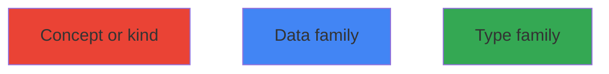
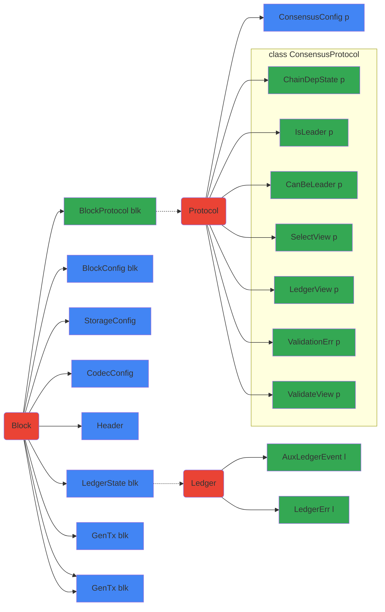

```mermaid
graph TB
  classDef df fill:#4285F4;
  classDef tf fill:#34A853;
  classDef kind fill:#EA4335;

  Concept[Concept or kind]; class Concept kind;
  DF[Data family]; class DF df;
  TF[Type family]; class TF tf;
```

```mermaid
flowchart LR;

  classDef df fill:#4285F4, border:10px;
  classDef tf fill:#34A853;
  classDef kind fill:#EA4335;

  Block(Block)-->BlockProtocol[BlockProtocol blk]; class Block kind;
  click Block "https://github.com/input-output-hk/ouroboros-network/blob/master/ouroboros-consensus/src/Ouroboros/Consensus/Block/Abstract.hs"
  Block-->BlockConfig[BlockConfig blk]; class BlockConfig df
  BlockProtocol[BlockProtocol blk]-.->Protocol(Protocol); class BlockProtocol tf;
  click BlockProtocol "https://github.com/input-output-hk/ouroboros-network/blob/master/ouroboros-consensus/src/Ouroboros/Consensus/Block/Abstract.hs"
  click BlockProtocol "https://github.com/input-output-hk/ouroboros-network/blob/master/ouroboros-consensus/src/Ouroboros/Consensus/Block/Abstract.hs"
  click BlockConfig "https://github.com/input-output-hk/ouroboros-network/blob/master/ouroboros-consensus/src/Ouroboros/Consensus/Block/Abstract.hs"
  Block-->StorageConfig; class StorageConfig df
  click StorageConfig "https://github.com/input-output-hk/ouroboros-network/blob/master/ouroboros-consensus/src/Ouroboros/Consensus/Block/Abstract.hs"
  Block-->CodecConfig; class CodecConfig df
  click CodecConfig "https://github.com/input-output-hk/ouroboros-network/blob/master/ouroboros-consensus/src/Ouroboros/Consensus/Block/Abstract.hs"
  Block-->Header; class Header df
  click Header "https://github.com/input-output-hk/ouroboros-network/blob/master/ouroboros-consensus/src/Ouroboros/Consensus/Block/Abstract.hs"
  Ledger(Ledger); class Ledger kind
  click Ledger "https://github.com/input-output-hk/ouroboros-network/blob/master/ouroboros-consensus/src/Ouroboros/Consensus/Ledger/Abstract.hs"
  Block-->LedgerState[LedgerState blk]; class LedgerState df;
  click LedgerState "https://github.com/input-output-hk/ouroboros-network/blob/master/ouroboros-consensus/src/Ouroboros/Consensus/Ledger/Basics.hs"

  Block-->GenTx[GenTx blk]; class GenTx df
  click GenTx "https://github.com/input-output-hk/ouroboros-network/blob/master/ouroboros-consensus/src/Ouroboros/Consensus/Ledger/SupportsMemPool.hs"
  Block-->ApplyTxErr[GenTx blk]; class ApplyTxErr df
  click ApplyTxErr "https://github.com/input-output-hk/ouroboros-network/blob/master/ouroboros-consensus/src/Ouroboros/Consensus/Ledger/SupportsMemPool.hs"
  Block-->ApplyTxErr[GenTx blk]; class ApplyTxErr df
  LedgerState-.->Ledger
  Ledger-->AuxLedgerEvent[AuxLedgerEvent l]; class AuxLedgerEvent tf
  Ledger-->LedgerErr[LedgerErr l]; class LedgerErr tf

  Protocol(Protocol); class Protocol kind
  ConsensusConfig; class ConsensusConfig df
  Protocol-->ConsensusConfig[ConsensusConfig p];
  subgraph ConsensusProtocol[class ConsensusProtocol]
    ChainDepState[ChainDepState p]; class ChainDepState tf
    IsLeader[IsLeader p]; class IsLeader tf
    CanBeLeader[CanBeLeader p]; class CanBeLeader tf
    SelectView[SelectView p]; class SelectView tf
    LedgerView[LedgerView p]; class LedgerView tf
    ValidationErr[ValidationErr p]; class ValidationErr tf
    ValidateView[ValidateView p]; class ValidateView tf
  end
  Protocol-->ChainDepState
  Protocol-->IsLeader[IsLeader p]
  Protocol-->CanBeLeader[CanBeLeader p]
  Protocol-->SelectView[SelectView p]
  Protocol-->LedgerView[LedgerView p]
  Protocol-->ValidationErr[ValidationErr p]
  Protocol-->ValidateView[ValidateView p]

```
