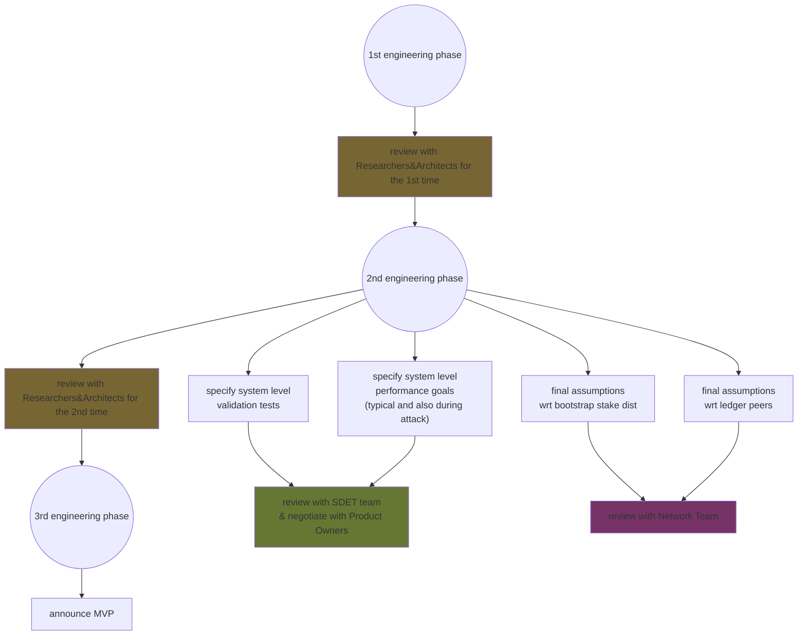
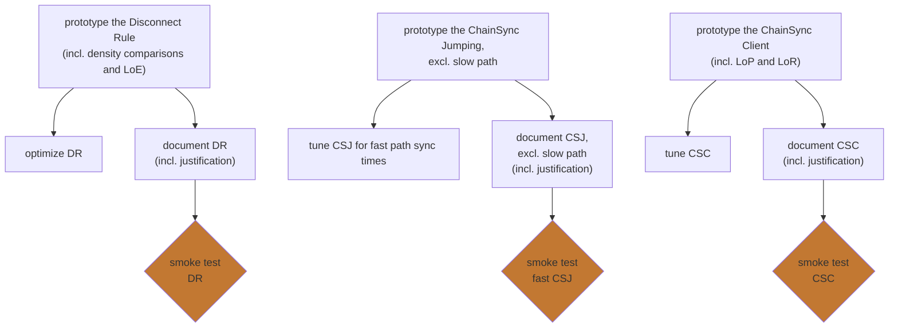
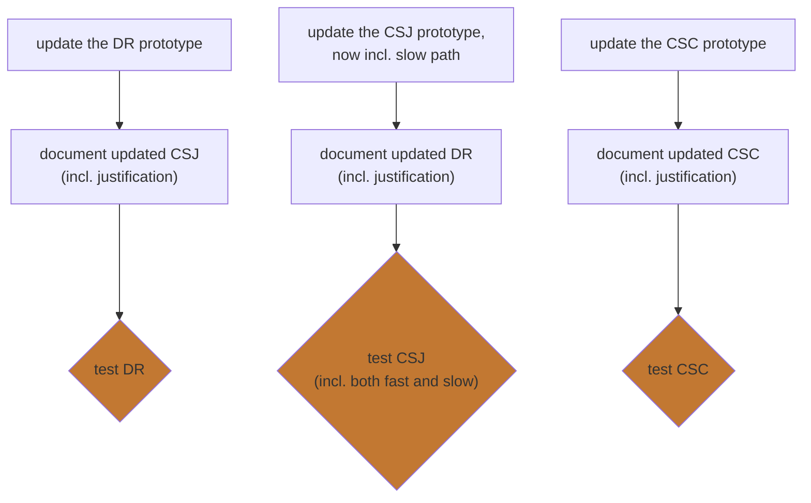
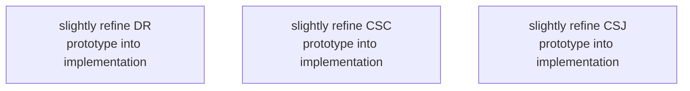

This document is a high-level decomposition of the remaining work for Genesis.

The parentheticals in some of the nodes are just clarifying notes to ourselves, not meant for more general audiences to interpret.

This top-level DAG captures all the of the remaining work.
Every node is a task (of varying difficulty).
An arrow from X to Y means that we cannot complete Y until we have completed X.
We typically can start Y before we finish X.

The circles will be expanded into other diagrams below; this document does not further decompose the rectangles.

This document makes no claims about time.
In particular, these phases are likely very assymetrical, so please do not assume they correspond to any unit of time.

## 1st Engineering Phase

We need to finish our design, justification for it, incl. tuned prototypes.
Then we can present it to the Researchers and Architects for criticism.

## 2nd Engineering Phase

We expect the first review to yield some alterations, which we now incorporate into the prototypes and the tests

## 3rd Engineering Phase

Finally, after testing the final prototypes, we can refine them into implementations, which together yield the MVP.

