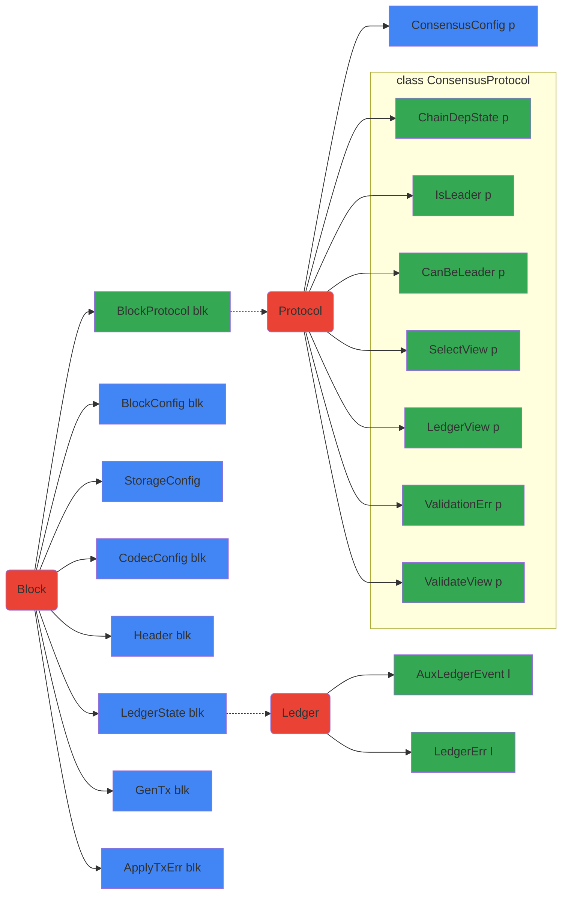

# Abstract Protocol

## Tutorials

### Overview

- [Ouroboros.Consensus.Tutorial.Simple](tutorials/Ouroboros/Consensus/Tutorial/Simple.lhs):
  Simple round-robin instantiation of the abstract Ouroboros consensus protocol.
- [Ouroboros.Consensus.Tutorial.WithEpoch](tutorials/Ouroboros/Consensus/Tutorial/WithEpoch.lhs):
  Example in which the leader schedule depends on data from the chain.

### Generating documents

From the `ouroboros-consensus` directory, run for your choice of `<output
file>`:

    pandoc -s -f markdown+lhs src-docs/Ouroboros/Consensus/Tutorial/Simple.lhs -o <output file>

## Key Type Families and Classes

The following diagram depicts the relation between various constructs in the
abstract specification of the protocol and the consensus-level view of th
ledger.
- Red boxes indicate concepts, or informal kinds (e.g., `ShelleyLedgerState`
  would have the informal kind `Ledger`).
- Blue boxes indicate data families.
- Green boxes indicate type families.
- Type or data families map the block attached to the incoming arrow to the
  block attached to the outgoing arrow. When there is no outgoing arrow, the
  family maps to any type (e.g., `BlockConfig blk`).


## Birds Eye Overview of Consensus Types (Galois)

See [Diagrammatic Conventions](#diagrammatic-conventions)

### Type Families (standalone and associated types)

From inspecting the directions of the arrows, it should be clear that `b :: B`
fully determines---directly or indirectly---all the other types.

``` haskell
 P[rotocol]                       B[lock]                       L[edger]                     -- (the P,B,L "kinds")
===                              ===                           ===
                                                                                                  ┏━━━━━━━━━━━┓
 p  ──(ConsensusConfig :: P→*)──────────────────────────────────────────────────────────────▶ cc  ┃{- static-}┃
 p  ◀──(BlockProtocol :: B→P)──── b ──(BlockConfig :: B→*)──────────────────────────────────▶ bc  ┃{- config-}┃
                                  b ──(LedgerState :: B→L)──▶ l ──(LedgerCfg :: L→*)────────▶ lc  ┃{- data  -}┃
                                                                                                  ┗━━━━━━━━━━━┛

                                  b ──(LedgerState :: B→L)──▶ l ──(AuxLedgerEvent :: L→*)──▶ lev   -- events emitted by ledger
                                                              l ──(LedgerErr :: L→*)───────▶ lerr  -- errors when updating ledger


                                  b ──(CodecConfig   :: B→*)──────▶ codecc -- for serialisation and deserialisation
                                  b ──(StorageConfig :: B→*)──────▶ sc     -- for (re)initializing the Storage Layer
                                  b ──(Header        :: B→*)──────▶ hdr    -- link block to its header

                                              b,l ──(HeaderHash :: *→*)──────▶ hash   -- link block/ledger to a hash

  p ──(ChainDepState :: P→*)──> cds     -- protocol specific state (part that depends on the chain), would rollback when chain does
  p ──(IsLeader      :: P→*)──> isldr   -- evidence that a node /is/ the leader
  p ──(CanBeLeader   :: P→*)──> cbldr   -- evidence that we /can/ be leader
  p ──(SelectView    :: P→*)──> hdrVwCS -- projection of header used for chain selection (using 'Ord hdrVwCS'); often 'BlockNo'
  p ──(ValidateView  :: P→*)──> hdrVwHV -- projection of header used for header validation (not full block validation)
  p ──(LedgerView    :: P→*)──> ledvw   -- projection of the ledger state ('l') that is required by the protocol
  p ──(ValidationErr :: P→*)──> valerr  -- the error result when failing to add new header to 'cds'

                     s ───(Ticked :: *→*)───▶ s'   -- time related changes applied to some state ('l', 'ledvw', 'cds')

                                  b ───(GenTx :: B→*)────────────────────────▶ tx      -- generalized transactions
                                  b ───(ApplyTxErr :: B→*)───────────────────▶ txerr   -- errors

                                  b,tx ───(Validated :: *→*)─────────────────▶ valb,valtx  -- add proof of validity to b,tx
```

### Type Constructors That are Type-Generic

These type constructors effectively function as type families (as type families are used in their definitions):
(This list is not exhaustive of all such types.)

```haskell
                                  b ────(Point :: B→*)───────────▶ point    -- newtype ... -- a point on the chain: hash & slotno

                                  b ────(LedgerConfig :: B→*)───────────▶ lc    -- type LedgerConfig b = LedgerCfg (LedgerState b)
                                  b ────(LedgerError  :: B→*)───────────▶ lerr  -- type LedgerError  b = LedgerErr (LedgerState b)
                                  b ────(TickedLedgerState :: B→*)──────▶ tls   -- type TickedLedgerState b = Ticked (LedgerState b)

                                  b,l ──(HeaderFields :: *→*)────────▶ data .. = .. SlotNo .. BlockNo .. HeaderHash b ..
                                  b ────(ChainHash :: B→*)───────────▶ data ChainHash b = GenesisHash | BlockHash !(HeaderHash b)
```

### Key Type Classes

The main `ConsensusProtocol` class:

```haskell
  class Ord (SelectView p) => ConsensusProtocol p where
    type family {ChainDepState, IsLeader, CanBeLeader, SelectView, LedgerView, ValidationErr, ValidateView} :: P → *
    checkIsLeader         :: cc → cbldr → SlotNo → Ticked cds → Maybe isldr          -- 'Just evidence' when we can lead this slot
    tickChainDepState     :: cc → Ticked ledvw → SlotNo → cds → Ticked cds           -- update the 'cds' based on passage of time (SlotNo)
    updateChainDepState   :: cc → hdrVwHV → SlotNo → Ticked cds → Except valerr cds  -- apply header to 'cds' (may error; leader check + etc.)
    reupdateChainDepState :: cc → hdrVwHV → SlotNo → Ticked cds → cds                -- re-apply header to 'cds' (never errors)
    protocolSecurityParam :: cc → SecurityParam                                      -- get security parameter 'k'
```
Classes connected to headers and blocks:
```haskell
 class (StandardHash b, Typeable b) => HasHeader b where -- abstract over block headers
   getHeaderFields :: b → HeaderFields b    -- i.e., return three fields: slot, blockno, hash

 class HasHeader (Header blk) => GetHeader blk where
   getHeader          :: b → Header b             -- extract header from the block
   blockMatchesHeader :: Header b → b → Bool      -- check if the header is the header of the block
   headerIsEBB        :: Header b → Maybe EpochNo -- when the header of an Epoch Boundary Block (EBB), ...
 
 class (HasHeader b, GetHeader b) => GetPrevHash b where   
   headerPrevHash :: Header b → ChainHash b       -- get the hash of predecessor
 
 -- construct the two views on block 'b' required by protocol 'p'
 class (GetPrevHash b, ConsensusProtocol p) => BlockSupportsProtocol b where              
   validateView :: bc → Header b → ValidateView p  -- project from hdr for hdr validation
   selectView   :: bc → Header b → SelectView p    -- project from hdr for chain selection
```
Classes connected to ledgers:
```haskell
  class GetTip l where                         
    getTip :: l → Point l               -- Point of the most recently applied block

  class (GetTip l, GetTip (Ticked l)) => IsLedger l where
    type family LedgerErr l      :: Type                   
    type family AuxLedgerEvent l :: Type
    applyChainTickLedgerResult   :: lc → SlotNo → l → LedgerResult l (Ticked l)  -- apply slot based state transformations (tip unchanged)
        
  class (IsLedger l, HeaderHash l ~ HeaderHash b, HasHeader b, HasHeader (Header b)) => ApplyBlock l b where
    applyBlockLedgerResult   :: lc → b → Ticked l → Except (LedgerErr l) (LedgerResult l l)  
    reapplyBlockLedgerResult :: lc → b → Ticked l →                       LedgerResult l l
    
  class ApplyBlock (LedgerState b) b => UpdateLedger b where
    {}

  -- | Link protocol to ledger
  class (BlockSupportsProtocol b, UpdateLedger b, ValidateEnvelope b) => LedgerSupportsProtocol b where
    protocolLedgerView   :: lc → Ticked l → Ticked ledvw   -- 'ledvw' ('LedgerView (BlockProtocol b)') extracted from the ledger
    ledgerViewForecastAt :: lc → l → Forecast ledvw        -- get a forecast (of future 'ledvw's) from a given ledger state.
      
  class (UpdateLedger b) => LedgerSupportsMempool b where
    txInvariant :: GenTx b → Bool                                                -- check if internal invariants of the transaction hold
    applyTx   :: lc → WhetherToIntervene → SlotNo → tx → tls → Except txerr (tls, Validated tx)      -- apply an unvalidated transaction
    reapplyTx :: lc →            SlotNo → Validated tx → tls → Except txerr tls          -- apply a previously validated transaction ...
    txsMaxBytes :: tls → Word32                                   -- max number of bytes of transactions that can be put into a block
    txInBlockSize :: tx → Word32                                  -- post-serialisation size in bytes of a 'GenTx b'
    txForgetValidated :: Validated tx → tx                        -- discard the evidence that transaction has been previously validated
```

## Some Commonly Used Base Types (from pkgs ouroboros-consensus, cardano-base, and ouroboros-network)

``` haskell
data Forecast a = 
  Forecast { forecastAt  :: WithOrigin SlotNo                                        -- Forecast a - Forecast the effect
           , forecastFor :: SlotNo -> Except OutsideForecastRange (Ticked a)         --              of time ticking
           }

data LedgerResult l a = LedgerResult { lrEvents :: [AuxLedgerEvent l]        -- LedgerResult l a - The result of invoking 
                                     , lrResult :: !a                        -- a ledger function that does validation
                                     }

data WithOrigin t = Origin | At !t

newtype SlotNo = SlotNo {unSlotNo :: Word64}                    -- SlotNo - The 0-based index for the Ourboros time slot.

data ChainHash b = GenesisHash | BlockHash !(HeaderHash b)

data HeaderFields b = HeaderFields { headerFieldSlot    :: SlotNo                       -- HeaderFields - fields we expect
                                   , headerFieldBlockNo :: BlockNo                      --                to be present in
                                   , headerFieldHash    :: HeaderHash b                 --                a block.
                                   }

-- | A point on the chain is identified by its 'Slot' and 'HeaderHash'.
newtype Point block = Point { getPoint :: WithOrigin (Point.Block SlotNo (HeaderHash block)) }

-- Point is commonly "viewed" as the following:
pattern GenesisPoint :: Point block
pattern GenesisPoint = Point Origin
pattern BlockPoint :: SlotNo -> HeaderHash block -> Point block
pattern BlockPoint { atSlot, withHash } = Point (At (Point.Block atSlot withHash))
{-# COMPLETE GenesisPoint, BlockPoint #-}

```
  
## And Some Commonly Used Projections

``` haskell
blockHash :: HasHeader b => b -> HeaderHash b
blockHash = headerFieldHash . getHeaderFields

blockSlot :: HasHeader b => b -> SlotNo
blockSlot = headerFieldSlot . getHeaderFields

blockNo   :: HasHeader b => b -> BlockNo
blockNo = headerFieldBlockNo . getHeaderFields
```

## Diagrammatic Conventions

- Code should all be viewed fixed-font, at least 140 chars wide.

- Regarding `P`, `B`, `L`
   - these are not kinds in the code, but "morally equivalent",  created for the sake of documentation.
   - `p`, `b`, and `l` are used as type names, respectively elements of the `P`,
     `B`, and `L` kinds.
  
- Associated types are not being distinguished from standalone type families.
  
- NOTE: For the sake of line-width, or clarity, "type variables" are sometimes
  used in place of "type-functions applied to variables".  This should not
  result in ambiguity.  E.g.,
   -  `p` in place of `BlockProtocol b`
   -  `cds` in place of `ChainDepState p`
  
- To reduce the "noise", these type-class constraints are being ignored:
  `NoThunks`, `Eq`, `Show`, `HasCallStack`; `Ord` is *not* being ignored.
