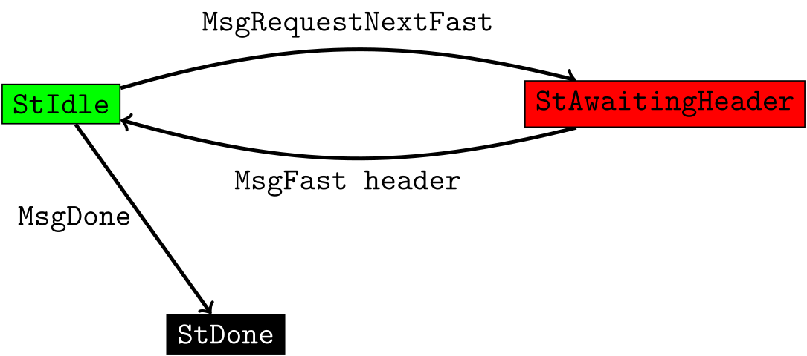

# Implementation overview of Diffusion Pipelining via Delayed Validation

> TODO: Add links to the architectural document ([#3597](https://github.com/input-output-hk/ouroboros-network/pull/3579)) and the FastLane sketch ([#3569](https://github.com/input-output-hk/ouroboros-network/pull/3569)).

## Changes to ouroboros-network

The new FastLane mini protocol is modeled by this simple state machine, where `StIdle` is the initial state, and green and red indicate client and server agency, respectively:

> TODO: Add the CBOR codec as well as the low-level client and server implementation. The client should be pipelined at a low depth to hide latency and to allow a peer to quickly communicate its new best block header without having to wait for a new FastLane request (new FastLane headers are always preferable).
>
> This should be a straightforward adaption of code of other mini protocols.

## Next priority

 - When receiving a header via FastLane, we have to check that it extends our current chain, but we also need some check that the peer can't overwhelm with lots of valid but useless (e.g. old) headers. One approach would be to reuse the existing invariants ensured by ChainSync. The goal is to assess how difficult it is to reuse this knowledge in FastLane, or whether it would be easier to merge FastLane into ChainSync.
 - Implementing the submission of the FastLane headers to the BlockFetch machinery and ensuring that the ChainDB can differentiate between normal and FastLane blocks.
