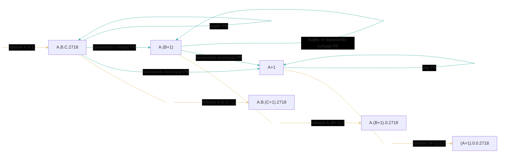
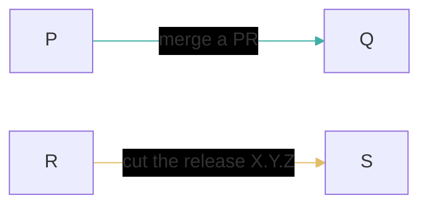

# Choosing a Versioning Schemes

This document records our discussions around choosing how to version our packages.

In its current state, the document is primarily focused on one question: for each individual package, how should the version listed in the `.cabal` file on the main integration branch relate to the version in the `.cabal` file in the latest release?
In particular, I think this question is almost entirely independent of usings `git` branches versus `git` tags for releases, SemVer versus PVP, etc.
This document should eventually specify that level of detail as well.

Given its current focus, without loss of generality, suppose the repository contains only one package while considering the proposals below.

## Desiderata

- *Conventional Version Numbers*.
  We'd like our release versions to have the standard shape of `A.B.C`, and the standard rules that `A` must increase for breaking changes, `B` must increase for backwards-compatible changes, and `C` must increase for anything else (eg bugfixes/documentation/etc aka "patches").

    - Some of our proposals below don't care about the distinction between `A` and `B`.
      Instead of repeating the semantics of `A` and `B` in each proposal, we refer to `next(A.B)` with the intention that the developer's determine whether to increment `A` or `B`.

    - You are of course free to decide any PR should increment `A` or `B` even if the proposed rules do not require it.
      Ultimately, the only risk of such spurious increases is confusing/inconveniencing downstream users.

    - Note, in the context of [the PVP](https://pvp.haskell.org/) eg, our `A` dimension here would itself denote a pair.

- *Simplicity and Familiarity*.
  We'd like the versioning scheme to be simple to explain and ideally already well-established.

- *Ease of Execution*.
  We'd like the process of cutting a release to merely involve following a very simple checklist.
  We'd like it to require as few inputs, discussions, decisions, etc as possible.

- *Distinguished Development Versions*.
  We'd like to distinguish between the two possible semantics of a version number.

    - The version of a released thing identifies some immutable thing, which is always somehow more refined than any thing---but especially another _released_ thing---that has a lesser version number.
      We denote this kind of version by "release version" below.

    - A development version refers to some mutable thing that is improving during the time between two releases, eg the version on the main integration branch.
      Note in particular that there will usually be multiple different commits that all have the same development version number.
      We denote this kind of version by "`main` version" below.

The main integration branch is typically named `main` in fresh GitHub repositories, so that's what we'll use in this document.

## Proposal RisingEdge

PRs do not alter the `main` version.

To cut a release from a commit COMMIT1 on `main` that declares version `A.B.C`, add to `main` a commit COMMIT2 that extends COMMIT1 merely to declare the version `next(A.B).0` or `A.B.(C+1)` depending on what has changed on `main` since the previous release, and announce COMMIT2.

Cons:

- `main` versions and release versions are not distinguished.

- Cutting a release requires assessing all the changes on `main` since the last release.

## Proposal FallingEdgePatch

A `C`-level PR doesn't alter the `main` version.
Each `A`-level PR must update the `main` version from `A.B.C` to `(A+1).B.0` unless `A.0.0` is already greater than the previous release.
Each `B`-level PR must update the `main` version from `A.B.C` to `A.(B+1).0` unless `A.B.0` is already greater than the previous release.

To cut a release from a commit COMMIT on `main` that declares `A.B.C`, announce COMMIT.
Also immediately update the `main` version to `A.B.(C+1)`.

Cons:

- `main` versions and release versions are not distinguished.

- Some `main` commits will declare version `A.B.(C+1)` even if that version is never officially released or is created only later by backporting _different_ (patch) commits to a previous release branch.

## Proposal Parity

Each `main` version `A.B.C` has an odd `B`.
Each release version `A.B.C` has an even `B`.
This is similar to the GHC Team's scheme.

PRs do not alter the `main` version.

To cut a release from a commit COMMIT on `main` that declares version `A.B` (where `B` is necessarily odd), announce a new non-`main` commit that extends COMMIT merely to declare version `X.Y = next(A.B)` (where `Y` is necessarily even).
Also immediately update the `main` version to `X.(Y+1)`.

Cons:

- Commits on `main` that only include patches since the previous release would still spuriously include the `Y+1` increment in the `B` dimension.

## Proposal NonZero

Each `main` version is degenerate; eg it is always version `0`.
Each release version is the usual `A.B.C`.

PRs do not alter the `main` version.

To cut a release from a commit COMMIT on `main` (that necessarily declares version `0`), announce a new non-`main` commit that extends COMMIT merely to declare the version to be `next(A.B).0`, or `A.B.(C+1)` depending on what has changed on `main` since the previous release.

Note that the degenerate versions could carry information.
EG they could be just a single number.
The only requirement is that they are inherently distinguished from release versions.

Cons:

- `main` versions would always be less than some older released version, which could cause confusion (among people and/or tools).

- Cutting a release requires assessing all the changes on `main` since the last release.

## Proposal Dimension

FYI

```
Prelude Data.Version> makeVersion [1,2] < makeVersion [1,2,0]
True
```

Each `main` version has only two dimensions: `A.B`.
Each release version has at least three `A.B.C`, where `C` can be `0`.

PRs do not alter the `main` version.

To cut a release from a commit COMMIT on `main` that declares version `A.B`, announce a new non-`main` commit that extends COMMIT merely to declare version `A.B.0`.
Also immediately update the `main` version to `next(A.B)`.

Pros:

- It enforces all desired invariants.

- It's a very mechanical state machine, easy to execute and also easy to immediately recognize which state it's in.

Cons:

- The multi-sorted state transition system prevents any explanation from being comparatively small.

- This scheme is certainly not already well-established!

- It incurs spurious increments of `A.B` when the only differences between two releases were patch PRs.

## Proposal Dimension124

Proposal Dimension above has the downside that it incurs spurious increments of `A.B` when the only differences between two releases were patch PRs.
The following enrichment adds the minimal amount of additional complexity to avoid that without losing any invariants.

Each `main` version is `A`, `A.B` where `B>0`, or `A.B.C.2718`; it is never three-dimensional.
Each release version is the usual `A.B.C`.
`2718` is just a recognizable magic number; it's so large it's unlikely to come up in actual versioning and it's the first digits of _e_, which is related to _growth_, which is what the `main` branch is for.

PRs alter the `main` version as indicated in the following diagram.

```
  A          --------[A-level PR]---------> A
  A          --------[B-level PR]---------> A
  A          --------[C-level PR]---------> A

  A.B        --------[A-level PR]---------> A+1
  A.B        --------[B-level PR]---------> A.B
  A.B        --------[C-level PR]---------> A.B

  A.B.C.2718 --------[A-level PR]---------> A+1
  A.B.C.2718 --------[B-level PR]---------> A.(B+1)
  A.B.C.2718 --------[C-level PR]---------> A.B.C.2718
```

To cut a release from a commit COMMIT on `main` that declares version `A`, announce a new non-`main` commit that extends COMMIT merely to declare version `A.0.0`.
Also immediately update the `main` version to `A.0.0.2718`.

To cut a release from a commit COMMIT on `main` that declares version `A.B`, announce a new non-`main` commit that extends COMMIT merely to declare version `A.B.0`.
Also immediately update the `main` version to `A.B.0.2718`.

To cut a release from a commit COMMIT on `main` that declares version `A.B.C.2718`, announce a new non-`main` commit that extends COMMIT merely to declare version `A.B.(C+1)`.
Also immediately update the `main` version to `A.B.(C+1).2718`.

The above is summarized in the following diagram, which relies on this legend depicting the semantics of the one kind of node (state) and the semantics of the two kinds of edges (transitions).


This diagram is a schema: one instance exists for every concrete value of the release version `A.B.C`.
Crucially: the result state of each `release X.Y.Z` transition also exists in its own instance of the schema.
Thus, this schema inductively defines an exhaustive (infinite) state machine.



The induced state machine ensures that each version is as meaningful as we'd like because `P <= Q` on every PR merge and `R < X.Y.Z < S` on every release.



Pros:

- It enforces all desired invariants.

- It's a very mechanical state machine, easy to execute and also easy to immediately recognize which state it's in.

- It allows for the natural minimal progression of release versions.

Cons:

- The multi-sorted state transition system prevents any explanation from being comparatively small.

- This scheme is certainly not already well-established!
