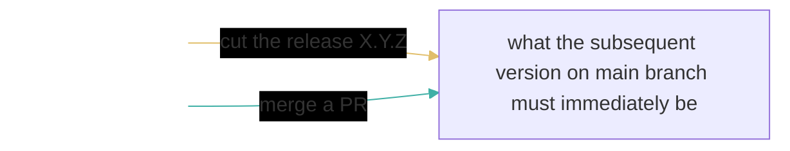
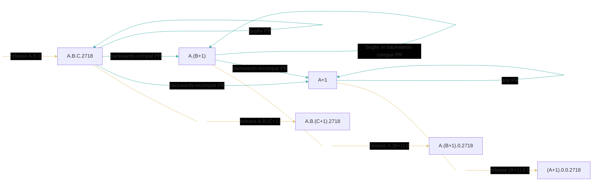
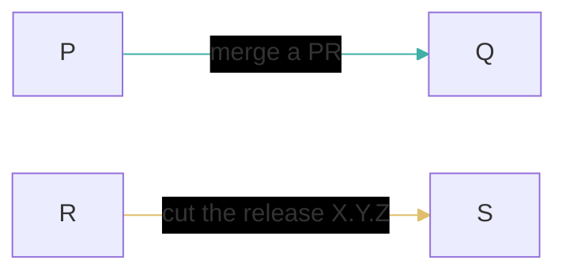

# Choosing a Versioning Schemes

This document records our discussions around choosing how to version our packages.

In its current state, the document is primarily focused on one question: for each individual package, how should the version listed in the `.cabal` file on the main integration branch relate to the version in the `.cabal` file in the latest release?
In particular, I think this question is almost entirely independent of usings `git` branches versus `git` tags for releases, SemVer versus PVP, etc.
This document should eventually specify that level of detail as well.

Given its current focus, without loss of generality, suppose the repository contains only one package while considering the proposals below.

## Desiderata

- *Conventional Version Numbers*.
  We'd like our release versions to have the standard shape of `A.B.C`, and the standard rules that `A` must increase for breaking changes, `B` must increase for backwards-compatible changes, and `C` must increase for anything else (eg bugfixes/documentation/etc aka "patches").

    - Some of our proposals below don't care about the distinction between `A` and `B`.
      Instead of repeating the semantics of `A` and `B` in each proposal, we refer to `next(A.B)` with the intention that the developer's determine whether to increment `A` or `B`.

    - You are of course free to decide any PR should increment `A` or `B` even if the proposed rules do not require it.
      Ultimately, the only risk of such spurious increases is confusing/inconveniencing downstream users.

    - Note, in the context of [the PVP](https://pvp.haskell.org/) eg, our `A` dimension here would itself denote a pair.

- *Simplicity and Familiarity*.
  We'd like the versioning scheme to be simple to explain and ideally already well-established.

- *Ease of Execution*.
  We'd like the process of cutting a release to merely involve following a very simple checklist.
  We'd like it to require as few inputs, discussions, decisions, etc as possible.

- *Distinguished Development Versions*.
  We'd like to distinguish between the two possible semantics of a version number.

    - The version of a released thing identifies some immutable thing, which is always somehow more refined than any thing---but especially another _released_ thing---that has a lesser version number.
      We denote this kind of version by "release version" below.

    - A development version refers to some mutable thing that is improving during the time between two releases, eg the version on the main integration branch.
      Note in particular that there will usually be multiple different commits that all have the same development version number.
      We denote this kind of version by "`main` version" below.

The main integration branch is typically named `main` in fresh GitHub repositories, so that's what we'll use in this document.

## Proposal RisingEdge

PRs do not alter the `main` version.

To cut a release from a commit COMMIT1 on `main` that declares version `A.B.C`, add to `main` a commit COMMIT2 that extends COMMIT1 merely to declare the version `next(A.B).0` or `A.B.(C+1)` depending on what has changed on `main` since the previous release, and announce COMMIT2.

Cons:

- `main` versions and release versions are not distinguished.

- Cutting a release requires assessing all the changes on `main` since the last release.

## Proposal FallingEdgePatch

A `C`-level PR doesn't alter the `main` version.
Each `A`-level PR must update the `main` version from `A.B.C` to `(A+1).B.0` unless `A.0.0` is already greater than the previous release.
Each `B`-level PR must update the `main` version from `A.B.C` to `A.(B+1).0` unless `A.B.0` is already greater than the previous release.

To cut a release from a commit COMMIT on `main` that declares `A.B.C`, announce COMMIT.
Also immediately update the `main` version to `A.B.(C+1)`.

Cons:

- `main` versions and release versions are not distinguished.

- Some `main` commits will declare version `A.B.(C+1)` even if that version is never officially released or is created only later by backporting _different_ (patch) commits to a previous release branch.

## Proposal Parity

Each `main` version `A.B.C` has an odd `B`.
Each release version `A.B.C` has an even `B`.
This is similar to the GHC Team's scheme.

PRs do not alter the `main` version.

To cut a release from a commit COMMIT on `main` that declares version `A.B` (where `B` is necessarily odd), announce a new non-`main` commit that extends COMMIT merely to declare version `X.Y = next(A.B)` (where `Y` is necessarily even).
Also immediately update the `main` version to `X.(Y+1)`.

Cons:

- Commits on `main` that only include patches since the previous release would still spuriously include the `Y+1` increment in the `B` dimension.

## Proposal NonZero

Each `main` version is degenerate; eg it is always version `0`.
Each release version is the usual `A.B.C`.

PRs do not alter the `main` version.

To cut a release from a commit COMMIT on `main` (that necessarily declares version `0`), announce a new non-`main` commit that extends COMMIT merely to declare the version to be `next(A.B).0`, or `A.B.(C+1)` depending on what has changed on `main` since the previous release.

Note that the degenerate versions could carry information.
EG they could be just a single number.
The only requirement is that they are inherently distinguished from release versions.

Cons:

- `main` versions would always be less than some older released version, which could cause confusion (among people and/or tools).

- Cutting a release requires assessing all the changes on `main` since the last release.

## Proposal Dimension

FYI

```
Prelude Data.Version> makeVersion [1,2] < makeVersion [1,2,0]
True
```

Each `main` version has only two dimensions: `A.B`.
Each release version has at least three `A.B.C`, where `C` can be `0`.

PRs do not alter the `main` version.

To cut a release from a commit COMMIT on `main` that declares version `A.B`, announce a new non-`main` commit that extends COMMIT merely to declare version `A.B.0`.
Also immediately update the `main` version to `next(A.B)`.

Pros:

- It enforces all desired invariants.

- It's a very mechanical state machine, easy to execute and also easy to immediately recognize which state it's in.

Cons:

- The multi-sorted state transition system prevents any explanation from being comparatively small.

- This scheme is certainly not already well-established!

- It incurs spurious increments of `A.B` when the only differences between two releases were patch PRs.

## Proposal Dimension124

Proposal Dimension above has the downside that it incurs spurious increments of `A.B` when the only differences between two releases were patch PRs.
The following enrichment adds the minimal amount of additional complexity to avoid that without losing any invariants.

Each `main` version is `A`, `A.B` where `B>0`, or `A.B.C.2718`; it is never three-dimensional.
Each release version is the usual `A.B.C`.
`2718` is just a recognizable magic number; it's so large it's unlikely to come up in actual versioning and it's the first digits of _e_, which is related to _growth_, which is what the `main` branch is for.

PRs alter the `main` version as indicated in the following diagram.

```
  A          --------[A-level PR]---------> A
  A          --------[B-level PR]---------> A
  A          --------[C-level PR]---------> A

  A.B        --------[A-level PR]---------> A+1
  A.B        --------[B-level PR]---------> A.B
  A.B        --------[C-level PR]---------> A.B

  A.B.C.2718 --------[A-level PR]---------> A+1
  A.B.C.2718 --------[B-level PR]---------> A.(B+1)
  A.B.C.2718 --------[C-level PR]---------> A.B.C.2718
```

To cut a release from a commit COMMIT on `main` that declares version `A`, announce a new non-`main` commit that extends COMMIT merely to declare version `A.0.0`.
Also immediately update the `main` version to `A.0.0.2718`.

To cut a release from a commit COMMIT on `main` that declares version `A.B`, announce a new non-`main` commit that extends COMMIT merely to declare version `A.B.0`.
Also immediately update the `main` version to `A.B.0.2718`.

To cut a release from a commit COMMIT on `main` that declares version `A.B.C.2718`, announce a new non-`main` commit that extends COMMIT merely to declare version `A.B.(C+1)`.
Also immediately update the `main` version to `A.B.(C+1).2718`.

The above is summarized in the following diagram, which relies on this legend depicting the semantics of the one kind of node (state) and the semantics of the two kinds of edges (transitions).



This diagram is a schema: one instance exists for every concrete value of the release version `A.B.C`.
Crucially: the result state of each `release X.Y.Z` transition also exists in its own instance of the schema.
Thus, this schema inductively defines an exhaustive (infinite) state machine.



The induced state machine ensures that each version is as meaningful as we'd like because `P <= Q` on every PR merge and `R < X.Y.Z < S` on every release.



Pros:

- It enforces all desired invariants.

- It's a very mechanical state machine, easy to execute and also easy to immediately recognize which state it's in.

- It allows for the natural minimal progression of release versions.

Cons:

- The multi-sorted state transition system prevents any explanation from being comparatively small.

- This scheme is certainly not already well-established!

Notes:

- The above state machine is natural for a monorepo, since you wouldn't make a release if nothing had changed.
  However, in a polyrepo, you might regret updating all the revisions to `A.B.C.2718` if you want to do your next release when some of the packages haven't changed.
  You can slightly complicate the state machine to avoid that happening.

    - Split the `A.B.C.2718` node into two: `A.B.C.2718` and just `A.B.C`.

    - Transition from `A.B.C` to `A.B.C.2718` only when merging a bugfix/etc PR.
      Otherwise `A.B.C` has the some outgoing transitions as `A.B.C.2718`.

    - Change all of the `release X.Y.Z` transitions to target `X.Y.Z`.
      Thus, you set the `main` version to the release version immediately after cutting a release, but _any_ PR affecting that package should increase its `main` version to at least `X.Y.Z.2718`.

## Proposal Redimensional

What should the version on your main branch as of merging a PR that changes your package?
The code is now more advanced than the previous release---call that `A.B.C`---so it should have a greater version than `A.B.C`.
That's either `A.B.(C+1)` for a bugfix, `A.(B+1).0` for new functionality, or `(A+1).0.0` for a breaking change.
Let's suppose the PR adds a feature and so sets the version to `A.(B+1).0`.
As a result, the resulting merge commit that declares that it defines version `A.(B+1).0` of the package.

If you were to now announce that commit as version `A.(B+1).0`, then all will be intuitive and risk no surprises.
However, suppose you never announce that commit; perhaps it's too incremental to trouble your users with a dedicated release.
Instead, the next thing you do is merge another feature PR.
There are three options for how that second feature PR should affect the version.
- The second PR bumps the version to `A.(B+2).0`.
  This would be unintuitive/surprising because now the timeline of releases will skip version `A.(B+1).0` of our package.
- The second PR bumps the version to `A.(B+1).1`.
  This would be very unintuitive/suprising for the same reason as `A.(B+2).0` and also because it violates the usual semantics of version components.
- The second PR leaves the version at `A.(B+1).0`.
  This would be unintuitive/surprising because there are now two commits (forever accessible via the main branch) that both claim to define version `A.(B+1).0` of the package.
  (Many readers might be unalarmed about that, but I suspect acceptance/the status quo is partly why.)

The above thought experiment generalizes to the following claim.

> Without a distinction between development versions and release versions, the maintainer must continually choose from the following unappealing options.
>
> - Have multiple commits (forever accessible via the main branch) that all claim to define the same version of the package.
> - Skip over some version numbers in the release timeline.
> - Release after every PR that changes the package.

How, then, to distinguish between dev versions and release versions?
The core requirements are as follows.
- Every release version should be familiar, eg the standard `A.B.C`.
  (In the context of [the PVP](https://pvp.haskell.org/) eg, this `A` component would itself contain two inner components.)
- Both must be compatible with standard tools.
  For example, standard tools must be able to parse both dev versions and release versions.
- The repository as of the merge commit of a PR must not declare release versions for packages that the PR changed.
- A package must have a release version as of a commit announced as a release of that package.
Thus the first PR that alters a package after the previous release must change that package's declared version from the release version to a dev version.

The remaining question is what should that dev version be for a specific PR?
Suppose the previous release was `2.2.2`.
Also suppose this PR is just a bugfix.
A promising idea is to use `2.2.2.0` as the new dev version.
- It has one more component than the release version, so it's distinct.
- Standard tools typically support a variable number of components.
- Moreover, `2.2.2.0` is greater than `2.2.2`, which seems intuitive: it's more correct than `2.2.2`.
- Similarily, it's less than all the possible next releases: `2.2.3`, `2.3.0`, and `3.0.0`.

Suppose instead the PR added a feature instead of fixing a bug.
Is it still the case that new version should be `2.2.2.0`?
It does seem surprising that a version `2.2.2.0` would have more _features_ than version `2.2.2`, since they both start with `2.2`.
One could dismiss this, arguing that `2.2.2.0` is obviously a dev version (it has the extra component), and so people who understand the distinction between dev versions and release versions would know not to infer anything more than "2.2.2.0 is at least one PR ahead of version 2.2.2".

However, standard tools do not understand the distinction!
In particular, `Cabal` will happily pick `2.2.2.0` when the downstream user has written the constraint as `>= 2.2.2 && < 2.3.0`.
In this case, because the commit that defines `2.2.2.0` adds a feature, `Cabal`'s naive inference based on `2.2.2.0 < 2.3.0` is unsound.
One could also dismiss this concern about tooling, though, because only devs (here or downstream) should ever be building dev versions, and they should only do so explicitly (eg building from source by building a git worktree or by listing a specific git commit as the dependency).
As long as no one installs a dev version package into a repository, there's no risk of a tool that picks amongst versions from some repository even considering a dev version.
Dev versions are never _released_, and so should never be in any public package repository such as Hackage or [CHaP](https://github.com/input-output-hk/cardano-haskell-packages).
The most likely way we can imagine a dev version might end up in a repository would be if a developer/user who doesn't know any better builds from source and installs a dev version into their machine's local package database.
That single risk seems manageable.

This suggests the following proposal.
- Each release version is `A.B.C`.
- Each dev version is `A.B.C.D`.
- Any PR that alters a package in a way that should affect the next release version should update its version as follows.
    - If the version was `A.B.C` before the PR, bump it to `A.B.C.0`.
    - If the version was `A.B.C.D` before the PR, bump it to `A.B.C.(D+1)`.
        - This rule isn't fundamental, but it ensures that every PR touches the version, which in turn ensures `git` will raise merge conflicts for backports/rebases/cherry-picking/etc.
          Those conflicts force the developer to make adjustments to versions.
          Those conflicts are necessary and also trivial to resolve but would be easy to overlook without this rule leveraging `git` to remind us.
          Additionally, this means that no two code-changing commits in the subset of a single branch will declare the same version---or set of versions if the repo has multiple packages---which seems intuitive.
        - Similar conflicts will also require updating open version-altering PRs after each version-altering PR is merged.
          Con: that will likely be tedious.
          Pro: it will likely lead to more linear integration branch history: you might was well rebase while you're updating the version bumps.
        - If you want `D` to exactly count the number of relevant PRs since the previous release, then you'll need to require every merge is a [fast-forward merge](https://git-scm.com/docs/git-merge#_fast_forward_merge); see [`git merge --ff-only`](https://git-scm.com/docs/git-merge#Documentation/git-merge.txt---ff-only).
- Cut a new release as follows.
    - Merge a fresh PR that doesn't alter the package but does bump dev version `A.B.C.D` to the next release version, depending on the contents of the relevant PRs since the previous release:
      `(A+1).0.0` if there were breaking changes, else `A.(B+1).0` if there were some new features, else `A.B.(C+1)`.
      (Note that `.D` is present, so at least one version-influencing change was made.
      If the version in the commit was still `A.B.C`, why are you announcing a new release?)
    - Announce that commit as a release of the packages that have changed since the previous release.
      (In a monorepo, there's just the one.
      But in a polyrepo, there may be packages that haven't changed since the previous release.)

## Proposal EasierRedimensional

There is a variant of the above that means only release PRs alter the version, which is more scalable.

- Each release version is `A.B.C`.
- Each dev version is either `A`, `A.B`, or `A.B.C.0`.
    - (We have fixed `.D` at `.0`, so that each PR doesn't need to alter it.
      This unfortunately does increase the risks of backports/rebases/cherry-picking/etc failing to bump the version.)
- Typical development PRs do not alter versions.
- Cut a new release as follows.
    - Merge a fresh PR that doesn't alter the package but does bump dev version `A.B.C.0` to the next release version, depending on the contents of the relevant PRs since the previous release:
      `(A+1).0.0` if there were breaking changes, else `A.(B+1).0` if there were some new features, else `A.B.(C+1)`.
      (Note that `.0` is present, so at least one version-influencing change was made.
      If the version in the commit was still `A.B.C`, why are you announcing a new release?)
    - Announce that commit as a release of the packages that have changed since the previous release.
      (In a monorepo, there's just the one.
      But in a polyrepo, there may be packages that haven't changed since the previous release.)
    - Immediately merge another fresh PR that adds the `.0` component to the versions of the just released packages.
      So what was `A.B.C.0` before the release became either `(A+1).0.0`, `A.(B+1).0`, or `A.B.(C+1)` after the first PR and now becomes either `(A+1).0.0.0`, `A.(B+1).0.0`, or `A.B.(C+1).0` after the second PR.

## Proposal Redimensional124

Recall that the motivation for Proposal Redimensional dismisses the concern that people and/or tools will be confused by `A.B.C.D` possible having more features or breaking changes compared to `A.B.C`.
Those not ready to dismiss that concern can consider the following proposal, which considers enough additional shapes of dev version to eliminate that risk.
- Each release version is `A.B.C`.
- Each dev version is either `A`, `A.B`, or `A.B.C.0`.
    - (We have fixed `.D` at `.0`, for consistency with the other two dev version shapes, which don't have the degree of freedom.
      This unfortunately does increase the risks of backports/rebases/cherry-picking/etc failing to bump the version.)
    - (It may be helpful to recognize `A.B.C.0` as `A.B.C + ϵ = A.B.(C+1) - ϵ`, `A.B` as `A.B.0 - ϵ`, and `A` as `A.0.0 - ϵ`, where ϵ stands for a 3-vector ["bigger than [`0.0.0`], but smaller than all the [others]"](https://en.wikipedia.org/wiki/Greek_letters_used_in_mathematics,_science,_and_engineering).)
- Any PR that alters a package in a way that should affect the next release version should update its version as follows.
    - If the version was `A` before the PR, leave it.
    - Else if the version was `A.B` before the PR:
        - If the PR makes a breaking change, bump it to `(A+1)`.
        - Else leave it.
    - Else if the version was `A.B.C.0` before the PR:
        - If the PR makes a breaking change, bump it to `(A+1)`.
        - Else if the PR adds new functionality, bump it to `A.(B+1)`.
        - Else leave it.
    - Else the version must have been `A.B.C` before the PR.
        - If the PR makes a breaking change, bump it to `(A+1)`.
        - Else if the PR adds new functionality, bump it to `A.(B+1)`.
        - Else bump it to `A.B.C.0`.
- Cut a new release as follows.
    - Merge a fresh PR that doesn't alter the package but does bump dev version to the next release version, as follows.
        - Bump `A` to `A.0.0`.
        - Bump `A.B` to `A.B.0`.
        - Bump `A.B.C.0` to `A.B.(C+1)`.
    - Announce that commit as a release of the packages that have changed since the previous release.
      (In a monorepo, there's just the one.
      But in a polyrepo, there may be packages that haven't changed since the previous release.)
    - Announce that commit.

## Proposal ScrivvyRedimensional

Maintain a `wip-status` directory for each package.

When merging a PR, add one of these empty files as appropriate to each package the PR alters.

- `<package>/wip-status/major/<scriv-id>`
- `<package>/wip-status/minor/<scriv-id>`
- `<package>/wip-status/patch/<scriv-id>`

(`<scriv-id>` is the timestamp, commit handle, and branch name, [like `scriv`](https://github.com/nedbat/scriv/blob/cd79a2a618eb752075bbf45e93ad6b7576a2924a/docs/index.rst#getting-started).)

In particular, if the PR should add `wip-status/minor/<this-PR-id>`, then it should do so even if `wip-status/major` is non-empty.
That would ensure that backporting this PR onto a branch with an empty `major` directory would still appropriately alter the `wip-status` directory.

Immediately before announcing the release of some package, merge a commit that does both of the following.

- Bump each package version according to the contents of its `wip-status` (leave it unchaged if the directory is empty).
- Remove all files from the three `wip-status/{major,minor,patch}` directories.

_Remark_.
If you maintain a separate changelog per package, then `scriv`'s [Categories](https://github.com/nedbat/scriv/blob/cd79a2a618eb752075bbf45e93ad6b7576a2924a/docs/concepts.rst#categories) can be leveraged for this, instead of these empty files.

Pros:

- A PR's contribution to the subsequent release's version bump is judged when reviewing the PR instead of being assessed (many days) later.

- It does not have distinct dev version and release versions, but inspecting the contents of a specific commit would let you determine whether its actually the release version it declares or else some evolution of it.
  But that requires inspecting the special files, which users, downstream devs, and standard tools won't do.
  (However, see the Remark below.)

Cons:

- It requires the additional consideration/discussion of which of the three `wip-status/{major,minor,patch}` directories to add the empty file in for each package the PR touches.
  This makes it a little harder to merge a PR, but not as much as writing the changelog entry would.
  (It avoids merge/rebase conflicts the same way that `scriv` does.)

_Remark_.
You could also add the extra `.0` version component from Proposal Redimensional in a commit immediately _after_ the release.
That extra `.0` would be naturally removed by the pre-release commit, since you're only releasing a package if its `wip-status` directory is non-empty.
It suffers the same coarseness of dev revisions as Proposal Redimensional, because every commit between release `A.B.C.D` and release `A.B.(C+1).0` would be versioned `A.B.C.*.0` even if some have more features than the other---and similar for major version bumps and breaking changes.
But that should be mostly harmless, since development versions (`A.B.C.D.0`) should be visible downstream only when developers are very explicitly opting-in to them.

# Second Draft of this whole document

When should you update the version declarations in your package manifests (eg the top-level `version:` field in your `.cabal` file)?
We would prefer for some unassailable authority to enumerate and explain the archetypal options, but we have not yet discovered such an article in our research or discussions.
This short document therefore assembles what prior art we have found into such a resource.

Executive summary: the challenge of maintaining versions is qualitatively equivalent to the challenge of maintaining a changelog.

### Design Space Overview

It's a surprisingly rich design space, but the following concepts delineate its perimeter and the main trends within it.

A principal dichotomy among possible version declaration maintenance schemes has become apparent during our research.
- Definition _RisingEdge_. The version declaration is altered by (some of the) development PRs; it's already correct when it comes time to announce a release.
- Definition _FallingEdge_. The version declaration is altered only immediately before announcing a release.

A few desiderata have also become apparent.
- Definition _TypicalReleases_. We do not want our releases to surprise downstream devs or users; no exotic release version numbers, no gaps or weird orderings in the sequence of released versions, neither too frequent nor too infrequent, etc.
- Definition _EasyPR_. We do not want our scheme to significantly increase the average- and worst-case effort required to prepare, usher, review, and/or merge a PR.
- Definition _EasyRelease_. We do not want our scheme to significantly increase the average- and worst-case effort required to prepare and/or announce a release.

The most extreme RisingEdge scheme would require that every PR increments the version number.

| TypicalReleases | EasyPR | EasyRelease |
|:---------------:|:------:|:-----------:|
| ✗               | ✗      | ✓           |

This rule is so simple that the ✗ for EasyPR is somewhat surpising.
The hidden problem is that this scheme causes spurious merge conflicts among all your PRs.
It would only be possible to merge PRs sequentially and merging one PR requires rebasing every other PR and updating its version number diff (assuming a single target branch).
That usually implies a very poor contributor experience.
(If you're wondering about variations on this, such as "only bump the version if it hasn't already been bumped", see [below](#RisingEdgeCompromises).)

We assign ✓ for EasyRelease because each release doesn't require any additional work; merely announce the result of the latest PR.
Relatedly, though, we assign ✗ for TypicalReleases because it's unrealistic to release after every PR.
Therefore the eventual timeline of your releases will have confusing gaps between the released version numbers.

The opposite scheme would be the most extreme FallingEdge scheme, in which normal PRs never change version declarations, only release-preparation PRs do.

| TypicalReleases | EasyPR | EasyRelease |
|:---------------:|:------:|:-----------:|
| ✓               | ✓      | ✗           |

We assign ✓ for TypicalRelease because this scheme constrains neither how often you release nor the evolution of version numbers.
We similarly assign ✓ for EasyPR because the scheme requires nothing from normal PRs.

However, we assign ✗ for EasyRelease because the scheme requires assessing all of the changes on this branch since the previous release from this branch.
This is a problem because PRs should be assessed while they're being developed and reviewed, active in the teams' minds, instead of some days/weeks later when the team has "paged out" the details of the PR.

It is unlikely that the version control history, the list of pull requests, or any other _automatic_ log can be used to trivialize the obligation of the post hoc assessment.
Even if we assume an ideal commit messages and/or PR descriptions, there will likely be a burdensome number of them.
The slightly more realistic assumptions of commit messages and/or PR descriptions that do have ideal content but don't have perfectly uniform structure means the assessor would still have to thoroughly read each, judging what the content requires of the version bump under consideration.

However, there is one standard log that can often make this assessment much easier: the changelog.
It's not automatic, but it is often structured around "additions/changes/etc", which are exactly what determines the next version under a policy like SemVer, for example.

Thus our final scheme to consider is a variant of FallingEdge that also requires/assumes the maintenance of a _bumplog_, which is merely a degenerate changelog that contains nothing more than what's necessary to determine the next version number for each changed packaged (ie one classification of `patch`, `minor`, and `major` for each merged PR).

| TypicalReleases | EasyPR | EasyRelease |
|:---------------:|:------:|:-----------:|
| ✓               | 90% ✓  | 95% ✓       |

We assign ✓ for TypicalRelease for the same reason as FallingEdge.
We assign a partial 90% ✓ for EasyPR because the presence of a correct bumplog entry requires non-trivial effort from the submitter and the reviewer.
We also assign a partial 95% ✓ for EasyRelease to account for the following small checklist for each release.
- Scan the bumplog entries that are new since the previous release from this branch.
  (We the degenerately minimal structure of the entries ensures this is easy.)
- Thereby determine what the next version should be for each package being released.
- Add a commit that sets those versions accordingly.

If you're envisioning a single bumplog file, then you might be wondering why this scheme wouldn't also incur spurious merge conflicts among PRs, etc.
Fortunately, this is already a solved problem for changelogs; see tools like https://scriv.readthedocs.io/en/latest et al.

_Remark_.
We chose 90% and 95% based on the use of a degenerate changelog.
Mature/stable projects likely already have a non-degenerate changelog that would make the pre-release assessment required by FallingEdge very simple, if not totally trivial.
Thus, such projects' teams might assign slighty better and/or worse scores to EasyPR and/or
EasyRelease to this scheme, depending on how they choose to resolve the tension between the bumplog and the structure/thoroughness of their actual changelog.
One notable option, though, is to keep the two separate: maintain the additional bumplog used only for assessing version bumps; we would still score that as above (90% EasyPR and 95% EasyRelease).

## Possible RisingEdge Compromises

<a id="RisingEdgeCompromises"/>There are some comprimises you could make to the most extreme RisingEdge scheme.

You could allowing for batched merges and only require that the single merge commit for a batched increases the version.
That would eliminate some of spurious conflicts, but not all.

You could also require that PRs don't need to bump the version if a previous PR has already sufficiently bumped it.
That would likely eliminate many of the spurious conflicts, but not amongst the first PRs after a release.
However, it comes with an additional subtle problem.
This scheme means that eg a bugfix PR merged after a new feature PR would not adjust the version declaration.
If that bugfix were then backported/rebased/cherry-picked onto a previous release commit, then now it _should_ being increasing the version.

The upshot is that schemes that depend on the order of PRs are brittle in the context of rebases/cherry-picks/etc.
We do not consider those operations to be exotic, especially since they are commonly used to backport some improvements to an older release branch, which is a relatively common task among stable/mature projects.

## Distinguishing dev versions and release versions

TODO discuss how to maintain the extra `.0` component, including a risk assessment of its motivation

## Annotated Bibliography

- https://semver.org is clear about how release versions should relate to one another, but doesn't advise about how to maintain them correctly in your repository.
  The same goes for https://pvp.haskell.org.

- https://opensource.guide/best-practices/#bring-in-the-robots mentions https://github.com/semantic-release/semantic-release.
  In our opinion, this tool relies too much on automation.
  A typo in your commit message, forgetting to the annotation in your commit message, etc could all lead to surprises.
  However, its clean specification supplies good inspiration for a human-friendly checklist.

- We realized the correspondence (obvious in hindsight) with the maintenance of changelogs when reviewing the process documented at https://github.com/input-output-hk/plutus/blob/master/doc/read-the-docs-site/RELEASE.adoc, especially the scripts.


-----

Desiderata:

- A.B.C is the version declared by an actual release.
    - For all time, the next greater released version is one of either A.B.(C+1), or else A.(B+1).0, or else (A+1).0.0.

- XXX is the version declared by source code during the development between releases.
    - A.B.C < XXX   and   XXX < A.B.(C+1)     and XXX < A.(B+1).Z     and XXX < (A+1).Y.Z

Problem: the version declaration of a commit should not be dependent on the
nearest preceding release on that branch.

EG the XXX declared by a bugfix commit immediately after the commit that
released A.(B+1).0 would might change the version declaration to A.(B+1).0 - epsilon.

However, it is common practice to cherry-pick that commit onto the commit that
released A.B.Z, in which case the bugfix's version declaration should instead be
A.B.(Z+1) - epsilon.


The internal version representation is A.x.B.y.C.z, where x y and z are sets of ids that uniquely map to development work.

The (partial) order is lexicographical.
Each A/B/C component uses the usual order on integers.
Each x/y/z component uses set inclusion (partial) order.
The actual release A.B.C is equal to A.{}.B.{}.C.{}.
(In fact, I think you can assert that number.number abbreviates number.{}.number.)

Every element of a set is X.Y.Z-timestamp-string.

- You must merge a PR whose source branch diverges from the target branch
  earlier than some release on the target branch--you have to rebase at least as
  far as the latest release on the target branch.

- X.Y.Z must be the version of the youngest release on the PR's source branch
  when it was merged.

- timestamp is most recent UTC time at which the X.Y.Z part of this id was
  changed (ie after the final rebase prior to merging the PR).

- string is arbitrary, but enough to avoid collisions (eg repository name and PR
  number is likely a useful start).

x must only contain ids starting with X.Y.Z where A     <= X.
y must only contain ids starting with X.Y.Z where A.B   <= X.Y.
z must only contain ids starting with X.Y.Z where A.B.C <= X.Y.Z.

IE you can backport work freely, but "forwardporting" work requires you to
update the ids appropriately.

Finally, extend the relevant parsers of ghc, ghc-pkg, cabal, stack, et al with the `version-directory:` field.

```
version: A.x.B.y.C.z
version-directory: $path/
```

Tooling must expect that path to be a directory.
It must also contain the ids as the names of files in the `$path/x/`, `$path/y/`, and `$path/z/` directories.
It must fail if any of those id files are non-empty.

Alternative: publish a git --merge-strategy that does set union to resolve conflicts in `dev-version-x:`, `dev-version-y:`, `dev-version-z:` fields, which must have one element per line.
