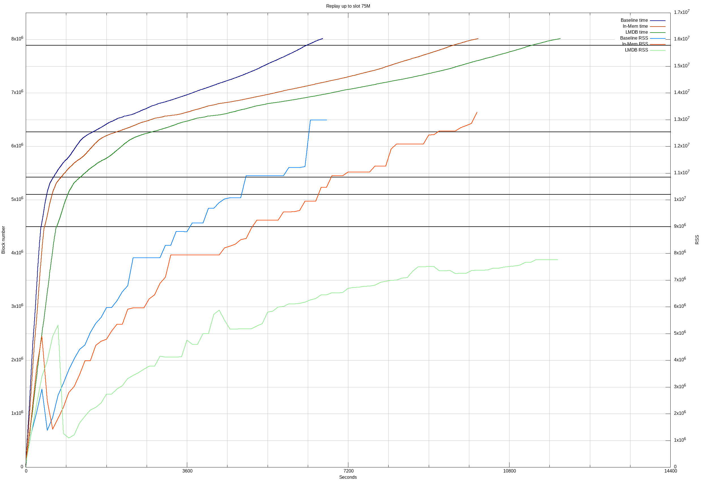
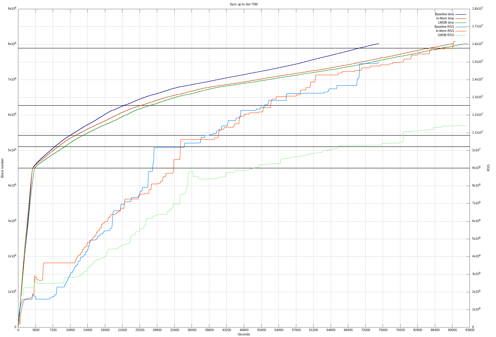

# UTxO HD 

This document describes the design followed to move the ledger state 
from memory to disk.

## Expected performance 

On a 64G machine, with a AMD Ryzen 9 5900X processor, we obtained the following
results when replaying and syncing from scratch up to slot 75M:

|                  | Replay max mem | Replay time | Sync max mem | Sync time |
|------------------|----------------|-------------|--------------|-----------|
| Baseline         | 13 GB          | 1:51 h      | 15 GB        | 20:46 h   |
| UTxO HD (in-mem) | 13 GB          | 2:50 h      | 16 GB        | 25:04 h   |
| UTxO HD (LMDB)   | 8 GB           | 3:15 h      | 11.4 GB      | 25:50 h   |

It is worth noting that these are single measurements, and they are only
intended to provide an indication of the expected performance.

These results correspond to obtained around 18 January 2023.

The plots below show how replay and syncing a node from scratch progress over
time, and how the memory usage evolves.

